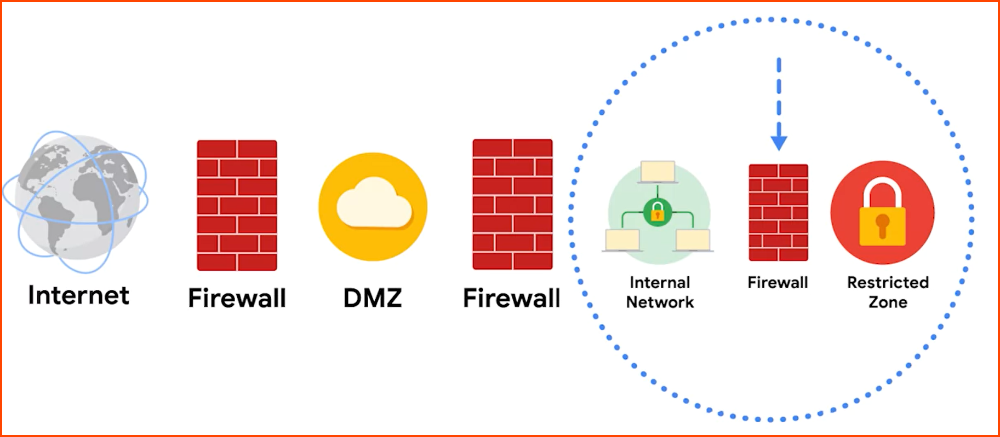

---
tags:
  - networking
  - security
---

An organizations network can be divided into two zones:  
**Uncontrolled Zone**: Network outside the organizations control (Internet, WAN)  
**Controlled Zone**: Subnet that protects internal network for uncontrolled zone

#### Demilitarized Zone (DMZ)
Public facing services that can access the internet  
Web Servers, Proxy Servers, DNS Servers, Email and File Servers

#### Internal Network (Intranet)e
Internal Private Network that the organization needs to protect  
Used for internal business  
Outside users (Internet, Extranet) cannot access resources on the Intranet

#### Restricted Zone
Private network that only business partners an access  
Used to store highly confidential and sensitive information  
Only accessible from Intranet

