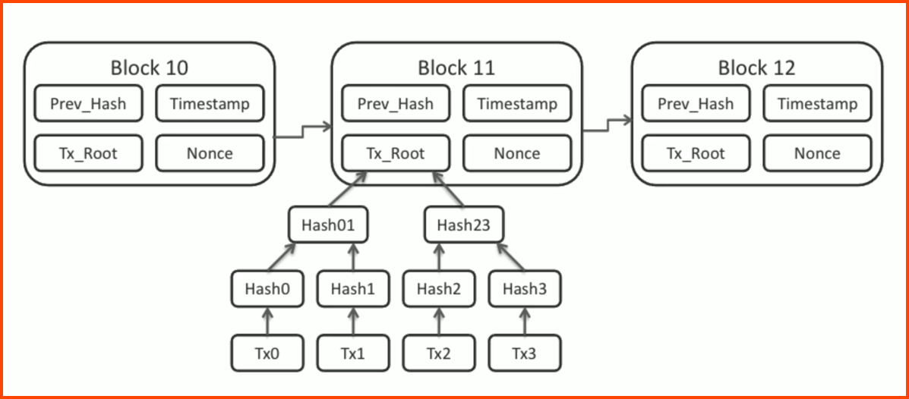

---
tags:
  - security
  - cryptography
  - concept
---

A shared immutable ledger for recording transactions, tracking assets and building trust  
It is a really long series of blocks with each block containing information  
Each block also contains the has for the previous block

### Public Ledger
A record-keeping system that maintains participants identities in a secure and anonymous format

### Smart Contracts
Self-executing contracts where the terms of agreement or conditions are written directly into lines of code  
Can automatically perform actions when certain conditions are met  
Once a smart contract is deployed, it cannot be altered, making the agreement tamper-proof and trustworthy

