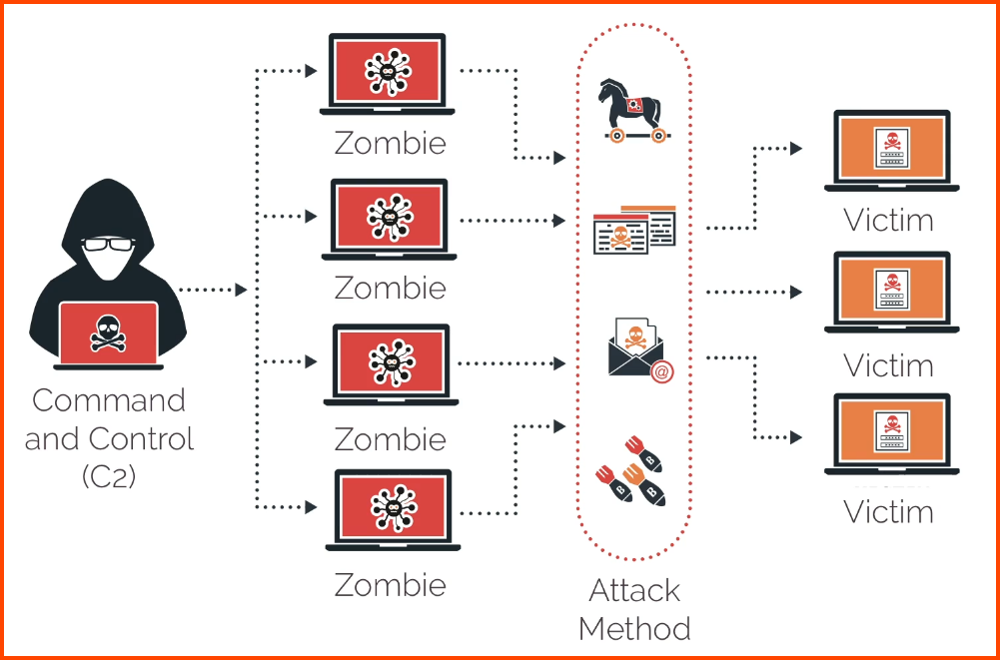

### Computer Virus
Code that runs on the machine without the user's knowledge and infects the computer
Viruses require user action to reproduce and spread

##### Boot Sector Virus
Stored in the first sector of the hard drive and loaded into memory on system boot  
Very difficult to detect

##### Macro Virus
Code embedded into a document that is executed when opened by the user

##### Program Virus
Tries to find executables or application to infect with malicious code

##### Multipartite Virus
A virus that combines boot and program viruses  
It attaches itself to the boot sector and system files before attacking other files

##### Encrypted Virus
Uses cipher to encrypt the malicious content to avoid detection

##### Polymorphic Virus
Advanced version of an encrypted virus that changes itself every time it is executed by altering the decryption module to avoid detection

##### Metamorphic Virus
Type of virus that can rewrite itself entirely before it attempts to infect a file  
It is an advanced version of the polymorphic virus

##### Stealth Virus
A virus that uses different techniques to hide from antivirus software  
Encrypted, Polymorphic and Metamorphic viruses are classified as Stealth Viruses

##### Armored Virus
A virus that has a layer of protection to confuse a program or person analyzing it

##### Virus Hoax
It is not a type of virus  
It is an attempt (Social Engineering) to get the user to install a virus on their system

### Worm
Malicious software that is like a virus but can replicate itself without any user interaction 
Worms can disrupt normal network traffic and computing activities  
Exploits security vulnerabilities to spread and replicate  
e.g. Nimda, Conficker
### Trojan
Malicious software that is disguised as a piece of harmless software or desirable software

##### Remote Access Trojan (RAT)
Providers the attacker with remote control of a victim's computer and is the most commonly used type of trojan

### Ransomware
Uses a vulnerability in your software to gain access and then encrypts the files  
Form of Blackmail and Extortion  
Backup Data, Update Software, Security Awareness Training, MFA  
e.g. Dusseldorf Hospital (Germany), Colonial Pipeline

### Botnets & Zombies

**Botnet**  
A collection of compromised devices under the control of a master node  
They are great for anything that is processing intensive  
Used for sending out phishing emails, malware and conducing DDoS attacks

**Zombie**  
A compromised device that is part of the botnet

### Rootkit
Software designed to gain administrative level control on the system without detection  
Rootkits are loaded before booting the OS and are difficult to detect and remove  
External systems scans are required to detect rootkit

Ring 0: Kernel Mode  
Ring 1: Administrator Mode  
Ring 3: User Mode  

##### DDL Injection  
Technique used to load malicious code into a running process by taking advantage of DDLs that are loaded at runtime  
DDLs are modular code and data that can be used by multiple programs  

The attack is achieved by using a shim. A shim is an interface that is placed between two components to intercept calls and redirect them

### Backdoors & Logic Bombs

**Backdoors**  
Used to bypass the normal security and authentication functionality of a application  
Remote Access Trojan (RAT) is an example of Backdoor

**Logic Bomb**  
Malicious code that has been inserted into the program that is only executed when a certain condition is met

### Keylogger
Software or hardware that records every single keystroke that is made by a device  
Identity Theft, Financial Fraud, Corporate Espionage  
Update Software, Good Antivirus, Phishing Awareness Training, MFA, Encrypt Keystrokes, Physical Checks

### Spyware & Bloatware
Malware that secretly gathers information about the user without their consent  
Could sometimes captures users keystrokes (keylogger) and take screenshots that are then sent to the attacker

**Bloatware**: Any software that comes pre-installed on a new system    
**Adware**: Displays ads based on the information its spying from you  
**Grayware**: Software that isn't benign or malicious but tends to behave improperly

---

### Malware Exploitation Techniques

Modern malware use **fileless** techniques to evade detection by signature based detection  

**Dropper or Downloader**  
Shellcode executed on target system  
Shellcode refers to malware code that gives the attacker a shell 

**Maintain Access**: Add infected system into C2 server  
**Strengthen Access**: Try to compromise other system of higher values  
**Actions on Objectives**: Achieve there goal/motive  
**Concealment**: Erase traces of entry into system

#### Malware Delivery Techniques
**Masquerading**: Replace genuine executable with malicious executable  
**DDL Injection**: Load malicious code during the load of an DLL  
**DLL Sideloading**: Make program load malicious DDL by modifying its manifest  
**Process Hollowing**: Load process in suspected state and rewrite its memory location with malicious code. Take over a place in memory

#### Living Off the Land (LOTL)
Exploit technique that uses standard system tools and packages to perform intrusions
Detecting adversaries that use this techniques is quite difficult as they are executing malware code within the OSes standard tools and processes

### Indicators of Malware Attack

**Account Lockout**: Unusual amount of users logged out of their account  
**Concurrent Session Usage**: User with multiple sessions for different locations  
**Blocked Content**: Attack trying to access & download blocked content  
**Impossible Travel**: Account accessed from geographically distinct location  
**Resource Consumption**: Unusually high resource utilization
**Resource Inaccessibility**: Could indicate a ransomware attack  
**Out-of-cycle Logging**: Logs contain actions & activities that should normally not be present  
**Missing Logs**: Logs deleted without any authorized reason  
**Published or Documented Attack**: Researcher publishes article on compromised company
