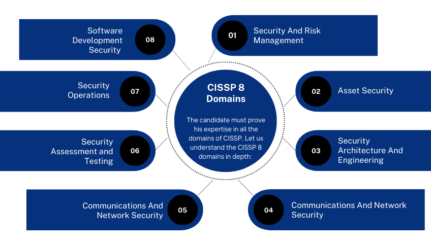

#### Security and Risk Management  
Security goals and objects, risk mitigation, compliance, business continuity and the law  
e.g. Creating new compliance rules for organization, Social Engineering Attacks

#### Asset Security
Securing digital and physical assets. Also related to the storage, maintenance, retention and destruction of data  
e.g. Save disposal of old assets, Physical Attack (USB, Thumb drive, Keycard Cloning)

#### Security Architecture & Engineering
Optimizes data security by ensuring effective tools, systems and processes are in place  
e.g. Configuring Firewall

#### Communication and Network Security  
Managing and security physical networks and wireless communication  
e.g. User behavior's analysis - employees connect to unprotected access points, Password Attack, Adversarial AI

#### Identity and Access Management
Keeping data secure by ensuring users follow established policies to control and manage physical assets, like office spaces, and logical assets, such as networks and applications  
e.g. Configuring employees keycard access, Adversarial AI

#### Security Assessment and Testing  
Conducting security control testing, collecting and analyzing data, and conducting security audits to monitor the risks, threats and vulnerabilities  
e.g. User permission audits - Ensure no unauthorized user can view sensitive data

#### Security Operations
Conducting investigation and implementing preventative measures  
e.g. Unknown device connected to network - follow procedures to stop potential threat

#### Software Development Security  
Uses secure coding practice's, which are a set of recommended guidelines that are used to create secure applications and services  
e.g., Ensure security best practices are incorporated into the software