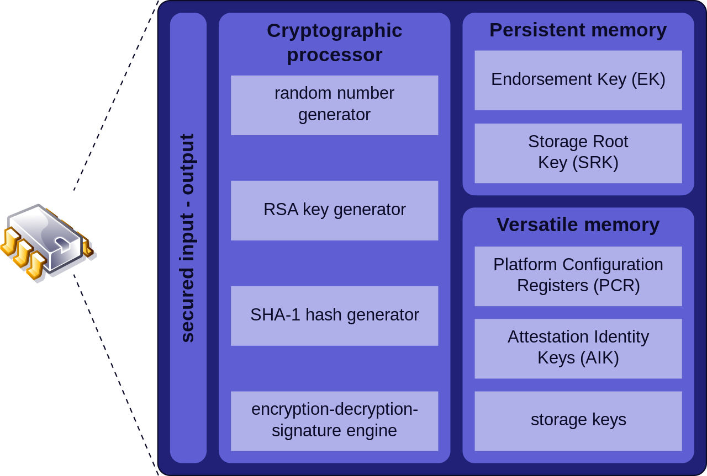

---
tags:
  - security
  - concept
  - device
---

### Root of Trust (RoT)
A cryptographic module embedded inside within a computer system that can endorse trusted execution and attest to the boot settings and metrics  
It scans the boot metrics and OS files to verify their signature, which we can then use to sign a digital report

#### Trusted Platform Module (TPM)  
A specification for hardware-based storage of digital certificates, keys, hashed passwords and other user and platform identification information

#### Hardware Security Module (HSM)
An appliance for generating and storing cryptographic keys that is less susceptible to tampering and insider threats than software-based storage

**Anti-Tamper**  
Methods that make it difficult for an attacker to alter unauthorized execution of software  
Can be enforced using Field Programmable Gate Array (FPGA) or a Physically Unclonable Function (PUF)  
These mechanisms zero out the cryptographic keys which in turn deletes the data on the system if any tampering is detected

---

### Trusted Firmware

**Unified Extensible Firmware Interface (UEFI)**  
A type of boot firmware that provides support for 64-bit CPU operations  
It has an GUI and provides mouse support.It also provides better boot security

**Secure Boot**  
A UEFI feature that prevents unwanted processes from executing during boot operation

**Measured Boot**  
A UEFI feature that gathers metrics to validate the boot process in an attestation report

**eFUSE**  
A means for software or firmware to permanently alter the state of a transistor on a computer chip

---

### Secure Processing

**Processor Security Extensions**  
Low-level CPU changes and instructions that enable secure processing  
AMD: Secure Memory Encryption (SME) & Secure Encrypted Virtualization (SEV)  
Intel: Trusted Execution Technology (TXT) & Software Guard Extensions (SGX)  

**Secure Enclave**  
The extensions allow a trusted process to create an encrypted container for sensitive data

**Bus Encryption**  
Data is encrypted by an application before it is placed on the data bus  
HDCP: HDMI cable copyright protection  