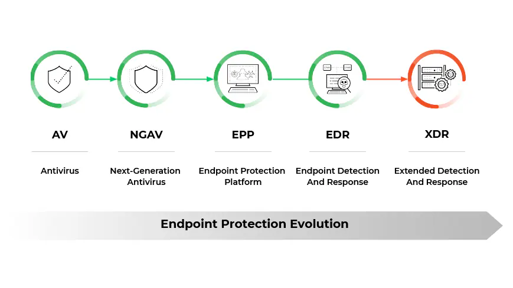

---
tags:
  - security
  - concept
  - device
---

#### Antivirus
Software capable of detecting and removing virus infections and other types of malware
They are limited to threat prevention and do not provide any insights/telemetry to the security team on what happened

#### Host-based [IDS and IPS](../../Computer%20Networks/Network%20Security/IDS%20and%20IPS.md)
System that monitors a computer system for unexpected behavior or drastic changes in systems state  

#### Endpoint Protection Platform (EPP)
A software agent and monitoring system that performs security tasks performed by multiple services like antivirus, HIDS/HIPS, DLP, Firewall and File Encryption  
It uses signature-based detection, heuristics and behavioral analysis for detecting threats   They work great at detecting known threats  
Mainly used for enforcing basic IT and security hygrine related activates

#### Endpoint Detection and Response (EDR)
Software agent that collects system data and logs to perform analysis to provide early threat detection  
They are proactive systems and supports continuous monitoring, threat detection and incident response  
It all has threat hunting features that can protect against new attacks

#### User and Entity Behavior Analytics (UEBA)
A system that can provide automated identification of suspicious activities by user accounts and computer hosts  
They are heavily dependent on advanced computational techniques like AI and ML  
e.g. Microsoft Advanced Threat Analytics & Splunk User Behavior Analytics

