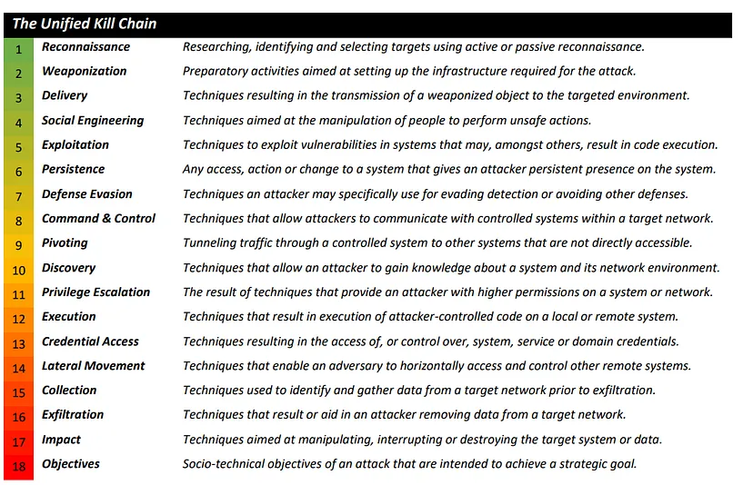

---
tags:
  - security
  - concept
  - framework
  - soc
---

#### Security Frameworks  
Guidelines used for building plans to mitigate risks and threats  
Purpose: Protecting PII, Protecting Financial data, Identify Security Weakness, Managing Risks, Aligning security with business goals  
Components: Setting Goals, Setting Guidelines, Implementing Processes, Monitoring & Communicating Results

### Lockheed Martin Cyber Kill Chain

**Reconnaissance**: Attacker determines what methods to use to complete/ perform the attack. Uses passive OSINT to gather information on target  

**Weaponization**: Attacker couples payload code (enables access) along with exploit code (exploits vulnerability on system)

**Delivery**: The attacker identifies a vector by which to transmit the weaponized code to the target environment

**Exploitation**: The weaponized code is executed on the target system by this mechanism

**Installation**: This mechanism enables the weaponized code to run a remote access tool and achieve persistence on the target system

**Command & Control (C2)**: The weaponized code establishes an outbound channel to a remote server that can then be used to control the remote access tool and possibly download additional tools to progress the attack

**Actions on Objective**: The attacker typically uses the access he has achieved to covertly collect information from the target systems and transfer it to a remote system (data exfiltration) or archive other goals and motives

Main focus of Framework: Malware Delivery and Network Security  
Does not detect: Insider Attacks  

### Unified Kill Chain (UKC)

[Unified Kill Chain: Raising Resilience Against Cyber Attacks](https://unifiedkillchain.com/)

Phase 1: In - Attacker tried to establish a initial foothold - Make of the 1st 9 stages  
Phase 2: Through - Attack seeks to gain additional privileges -  Covers Stages 9 to 14  
Phase 3: Out - Action of Objective of Attack - Covers Stages 15 to 18

### Diamond Model of Intrusion Analysis

A framework for analyzing cybersecurity incidents and intrusions by exploring the relationship between four core features: adversary, capacity, infrastructure and victim

**Adversary Operator**: Hacker conducting the intrusion activity  
**Adversary Customer**: Entity that stands to benefit from the intrusion activity

**Victim Persona**: People and organization being targeted  
**Victim Assets**: The attack surface that is used

**Type 1 Infrastructure**: Infrastructure controlled by Adversary  
**Type 2 Infrastructure**: Infrastructure controlled by a intermediary

Extended Diamond Model consists additionally 6 meta-features and 2 axis's:  
**Meta-Features**: Timestamp, Phase, Result, Direction, Methodology, Resources  
**Axis**: Social-Political & Technology

### MITRE ATT&CK Framework

A knowledge base mentioned by MITRE for listing and explaining adversary tactics, techniques and procedures (common knowledge)  

The pre-ATT&CK tactics matrix aligns to the reconnaissance and weaponization phase of the Cyber Kill Chain while the ATT&CK Enterprise framework aligns to the remaining stages of the Cyber Kill Chain

A separate ATT&CK framework exists for mobile devices

### NIST Risk Management Framework (RMF)

**Prepare**: Steps that are required to manage security before a incident occurs  
**Categorize**: Used to develop risk management processes   
**Select**: Choose, customize and capture documents that controls the protection  
**Implement**: Implement security and privacy plans  
**Assess**: Determine if controls are implemented correctly  
**Authorize**: Being accountable for the security and privacy risks that might exist  
**Monitor**: Be aware of how systems operate

### NIST Cyber Security Framework (CSF)

**Identify**: Management of risks and its effects on people and assets  
e.g. Monitoring organizations assets to detect security incidents  
**Protect**: Strategy used to protect an organization (policies, procedures, training, tools)  
**Detect**: Identifying potential security incidents and improving monitoring  
**Respond**: Ensure proper procedures are used to contain, neutralize and analyze incident  
**Recover**: Return affected systems to normal operations 

NIST S.P. 800-53: NIST CSF designed to be used by the federal government

**Core**: The desired security outcome of a security plan (the 5 functions above)  
**Tiers**: A way of measuring the sophistication of an organizations cybersecurity program  
**Profile**: Templates that are tailored to address the specific risks of an organization

### OWASP Security Principles

Minimize attack surface area: Disable unrequired features, complex passwords, etc.
Principle of least privilege: Limits the damage done when breach occurs  
Defense in depth: Should use multiple different security controls (MFA, Firewalls, ACL, IDS) Separation of duties: Critical actions should rely on multiple people  
Keep security simple: Complex security systems can become unmanageable  
Fix security issues correctly: Weak Wi-Fi passwords, etc.

[OWASP Developer Guide | Principles of Security | OWASP Foundation](https://owasp.org/www-project-developer-guide/draft/04-foundations/03-security-principles)
