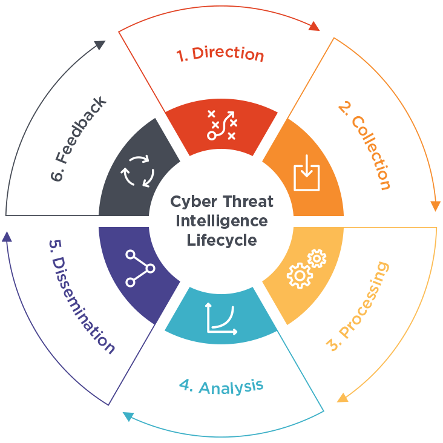

---
tags:
  - security
  - concept
  - soc
---

Evidence based knowledge about adversaries  
This includes there indicators, tactics, motivations and actionable insights

**Data**: Discrete indicators associated with a adversary  
**Information**: A combination of multiple data points  
**Intelligence**: The correlation of information and data to extract patterns based on contextual analysis

### Threat Hunting

Proactively searching for cyber security threats that might be lurking undetected in the organizations network  
When threat hunting we need to assume that all the existing security controls have failed  

Allows to improve detecting capabilities, reduce attack surface, block attack vectors, identify critical assets

### Threat Intelligence

Threat Intelligence can be gathered from different sources: Internal, Community, External  
Threat Intel is geared towards understanding the relationship  between the operational environment (organization) and adversary  

CTI Sources Properties: Timeliness, Accuracy, Relevancy, Confidence Level  
Source Types: Proprietary, Closed-Source (FireEye), Open-Source (US-CERT, AT&T Security, MISP, Spamhaus, VirusTotal), Implicit Knowledge

**Strategic Intel**: High-level intel that looks into the organizations threat landscape  
**Technical Intel**: Looks into evidence and artifacts of attack used by the adversary  
**Tactical Intel**: Assesses adversaries tactics, techniques and procedures (TTPs)  
**Operational Intel**: Looks into the adversaries specific motive to perform the attack

### Cyber Threat Intel (CTI) Lifecycle

#### Planning & Direction
Deciding the objectives and goals of the threat intel  
e.g. Systems to be protected, source of data and intel to use, impact of lose of impact, tools and resources required, pose questions related to incidents

#### Collection
Gather the required data using various resources  
Employees automation to sift through large volumes of data

#### Processing
Data collected from different sources use different structures and are no correlated  
Extract, sort, organize, correlate and represent in a visual format

#### Analysis
Derive insights from the information that is processed  
e.g. Defining action plan to avert an attack, strengthening security controls

#### Dissemination
Different organizational stakeholders will consume the intelligence in variety of languages and formats

#### Feedback
Use the feedback provided by the various stakeholders to improve the threat intelligence process and implementation of security controls
