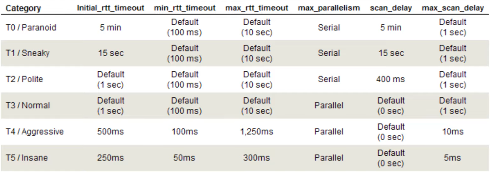

When increasing the speed of scan or increasing the parallelism of the scan the results received are going to be less reliable

#### Timing Template

T0 to T5 are referred to as timing template.  
T0 is very rarely used. T1 can be used to evade older firewalls and IDS. T2 is also very rarely used. T3 is the default speed. T4 is used to speed up the scan. T5 is an very aggressive scan.



````bash
nmap -sS -T4 <ip-address>
````

#### Parallelism

Specify the number of scans that can be performed in parallel. By default Nmap looking on the type of scan and the size of the network decides the number of parallel scans to perform

````bash
nmap -sV --min-parallelism 10 <ip-address>
nmap -sV --max-parallelism 10 <ip-address>
````

#### Host Group Sizes

You can customize the minimum and maximum host group size when performing large scans that involve entire subnets. The host group size allows you to specify how many hosts to scan simultaneously

````bash
nmap -sS --min-hostgroup 20 192.168.1.1/24
nmap -sS --max-hostgroup 10 192.168.1.1/24
````

#### Host Timeout

Host timeout is used to specify the amount of time to wait when scanning a target before skipping the host.

````bash
nmap -Pn --host-timeout 30s 192.168.1-255.1-255
````

#### Scan Delay

This allows you to pause Nmap for a specific amount of time between each probe/request. This is great for targets or systems that have some form of rate-limiting in place.

````bash
nmap -sS --scan-delay 10s <ip-address>
````

#### Packet Rate

This option allows you to specify the minimum and maximum amount of packets you want to send per second.  
Higher the scan rate the less accurate the result, it will also increase detection by IDS and not all systems are able to handle such high traffic rates.

````bash
nmap -sT --min-rate 20 n<ip-address>
nmap -sT --max-rate 50 <ip-address>
````
