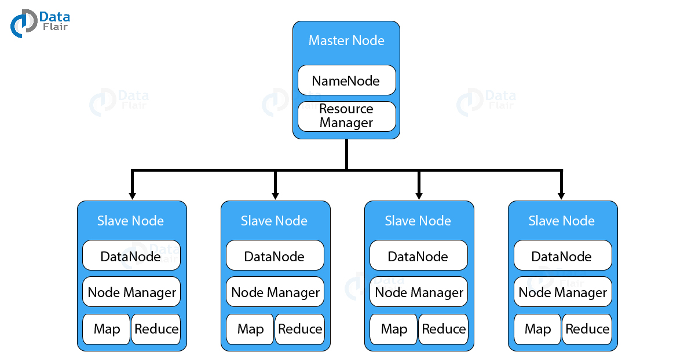

### Namenode (Master)

Master responsible for co-ordination  
Stores only the metadata  
Default only 1 (Single Point of Failure)  
High Availability  
Secondary Namenode (Cold Backup)  
Can be set manually as well

### Datanode (Slave)

Horizontal Scalability (Can have as much as needed) (>35000)  
Stores data  
3 secs -> TCP signal to Namenode (Heart Beat)  
No reply in 10 min (Deadnode)

---

### Types of Clusters

1. Single Node Setup (All 5 demons on the same node)
2. Pseudo Distributed Environment (Each daemon runs in a separate VM)
3. Multinode cluster (Each daemon in separate node)