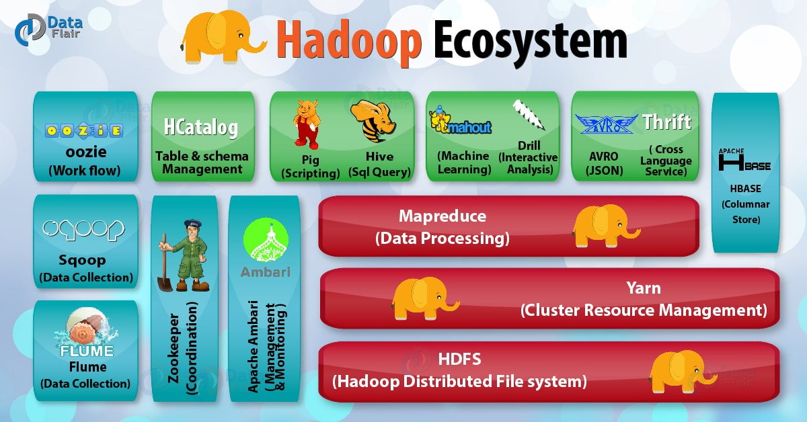
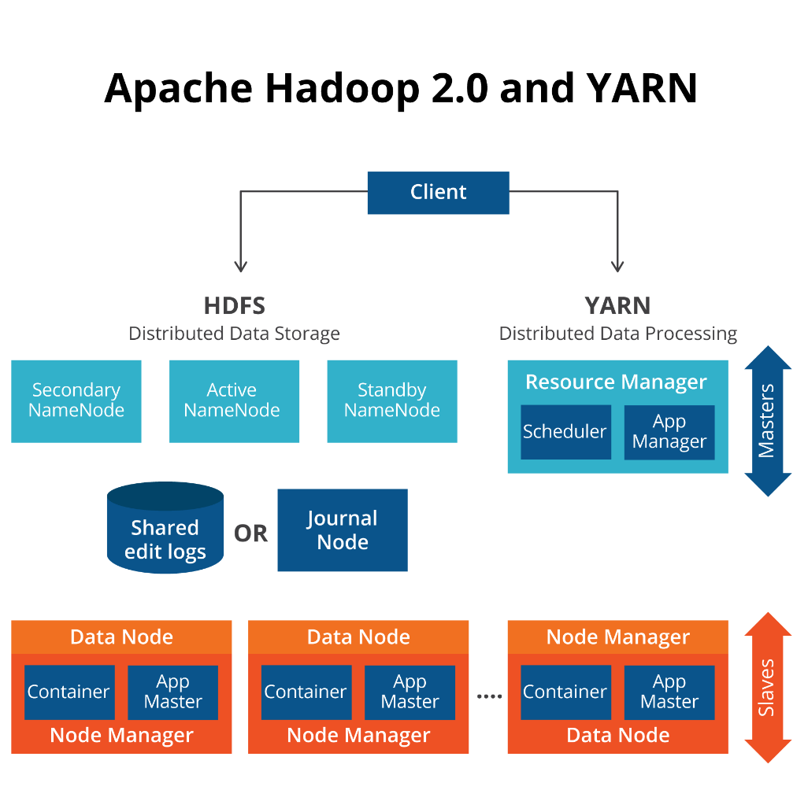

1. Scalability
	* Horizontal (Add new nodes to the cluster)
	* Vertical (Increase the performance of an single device)
2. Distributed (Storage & Processing)
	 * Massively Parallel Processing (MPP)
3. Data Availability
4. Fault Tolerance

---

### Features/ Characteristics (SDR)

1. Sharding (Split file into small chunks)
	* Default : 128MB
	* WoRm (Write Once, Read Many)
	* Once written Chunk size cannot be changed
2. Distributed
	 * MPP
	* Consistency & Availability (CAP Theorem)
3. Replication Factor
	 * Default : 3 times
	* Min : 1, Max : 512

