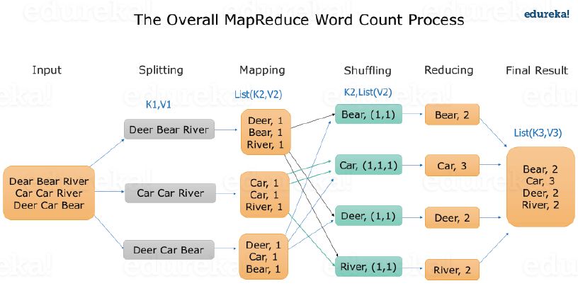

### Massive Parallel Processing

* It is an model to process the distributed data in a parallel way
* It is the data processing engine in Hadoop
* Mapper is user defined. Format of data (key, value) pair

In Hadoop we do not fetch all the data and then process it rather the processing is done on the data in place (The code goes to the data) and the result is returned back

### Steps in MapReduce

1. MAPPER creates Key Value pair from the raw data (Can have repeating keys)
2. MapReduce algorithm then automatically Sorts and Groups the Mapped Data (Shuffled and Sorted) - The same key are grouped together and all the keys are arranged in ascending order
3. REDUCER processes each key (It is called once for each unique key)

 > [!NOTE]
 > * Combiner is an Reducer which is performed on each mapper
 > * It cannot be used for averaging and calculating percentage (As the result of individual reducer will be different from global reducer) - Similar to ReduceByKey() in Spark

---

**<u>References</u>**:

* [Confused About Map/Reduce? - DZone Big Data](https://dzone.com/articles/confused-about-mapreduce)