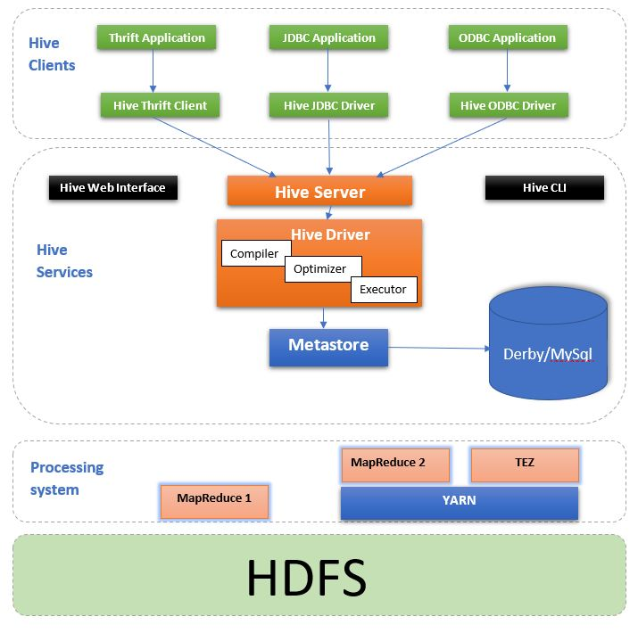

Used for data warehousing. Used to process and query structured data in OLAP  
It makes use of RDB and HDFS (RDB -> Metadata/ Schema, HDFS -> Actual Data)  
The default RDB used Derby. It is referred to as the metastore  
Language used to Query: HQL (Hive Query Language) - Similar to SQL  
Hive does not convert the data into tables but rather enforces an schema on the data that helps to perform SQL like operations on the underlying data  
It allows Ad-hoc querying. Its Extensible and Fast  
Hive commands can be automated by writing then in a \*.q script file (Similar to \*.sql file)

---

### Limitations

Not meant for Real time processing  
Can't be used for OLTP  
High Latency

### Difference between HDFS and Hive

HDFS - Data  
Hive - Data with Schema