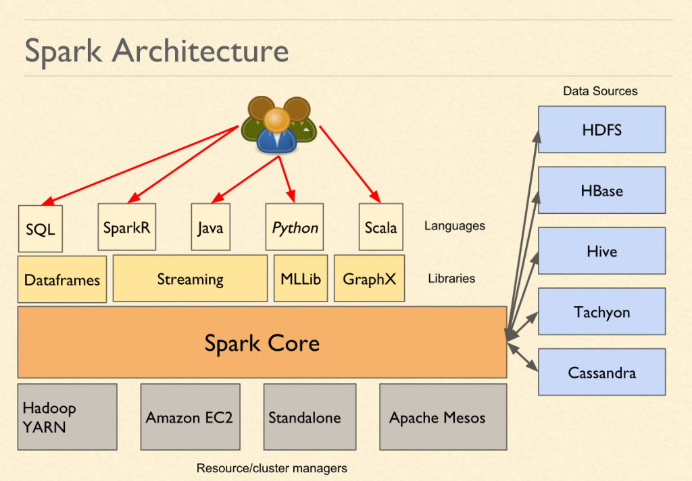

Spark is a In-memory processing engine  
Created by Amp Lab (Databricks) in 2009. It was found to be 100x faster than MapReduce  
In Spark v1.6.0 the Catalyst Optimizer (Tungsten Engine) was added which made Spark even faster  
Spark is written in Scala but supports writing code in Python, R, Java and SQL (Polyglot)

---

Provides Libraries for various workloads/ types of data:

* Streaming: Spark Streaming
* Machine Learning: Spark Mllib
* SQL Queries: Spark SQL
* Graph: GraphX

---

Spark can be run on YARN, Mesos, Kubernetes, EMR (Elastic MapReduce) or Standalone Mode  
Most of the time YARN is used

Spark has no limitation on the type of data source and destination it can be anywhere  
Spark does not have an inbuilt storage solution so we need to provide an distributed storage environment  
In Standalone mode data cannot be saved outside Spark

Spark is meant as replacement for MapReduce. It is not an replacement for Hadoop  
UDFs are generally not used in Spark but can be created

Spark allows to write SQL queries using DSL (Domain Specific Language)  
DSL and SQL commands can be used interchangeably

---

### Spark SQL

spark-sql (Spark SQL Prompt): Allows to perform SQL style queries on data using Spark Engine 

* Spark SQL (Default storage local FS) - Spark Warehouse
* If there is already Hive DB then if we add data using Spark it is stored in HDFS
* The metastore used by Hive and Spark is the same
