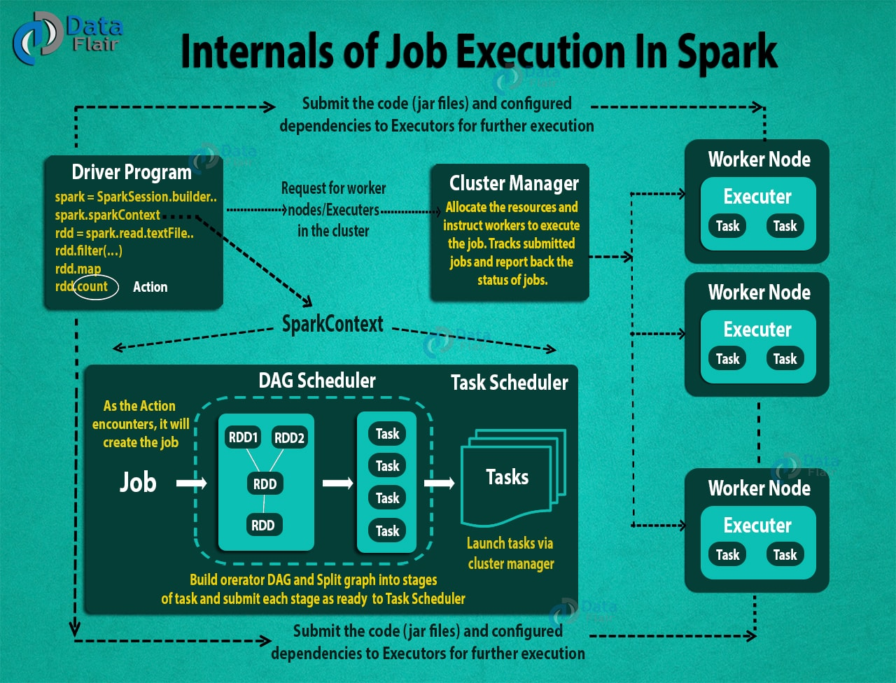

### Job

A piece of code that has all the operations to be performed are specified

### Task

A single operation performed on each partition of data

### Stage

The operations that are pipeline together  
Shuffle operation always creates a new stage

No. of task = No. of partitions  
1 task runs on 1 partition on 1 executor  
No. of stages = No. of shuffling + 1

---

### Job Execution

When action is encountered in code a Job is created  
DAG Scheduler is responsible for creating a graph and splits it into stages of tasks to submit to the Task Scheduler  
Task Scheduler launch's the tasks using cluster manager (Responsible for allocation worker and executor in worker)  
Cluster Manager instructs the worker node to execute the job. It tracks jobs and report back the status of jobs

---

**<u>References</u>**:

* [Spark Basics : RDDs,Stages,Tasks and DAG | by saurabh goyal | Medium](https://medium.com/@goyalsaurabh66/spark-basics-rdds-stages-tasks-and-dag-8da0f52f0454)