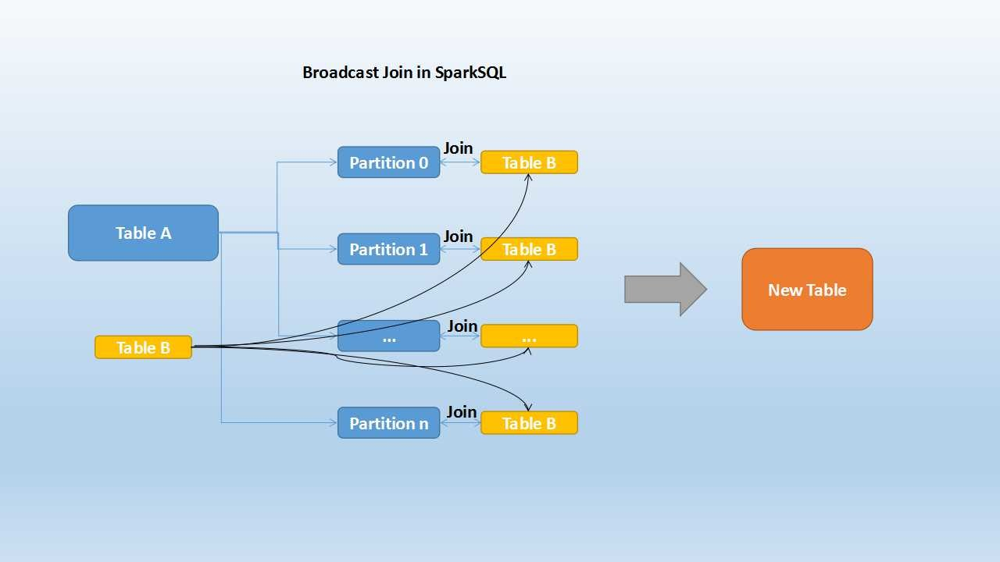
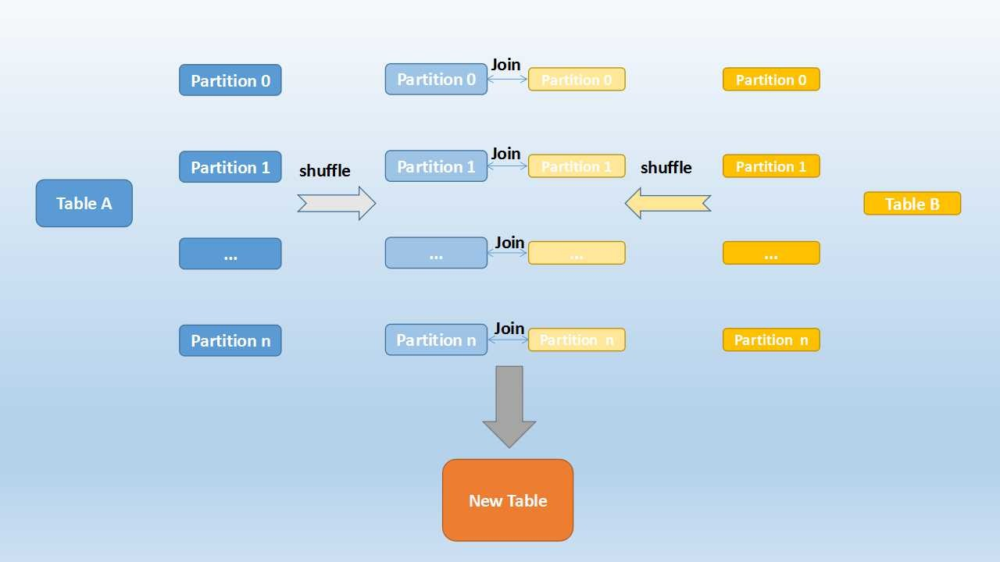
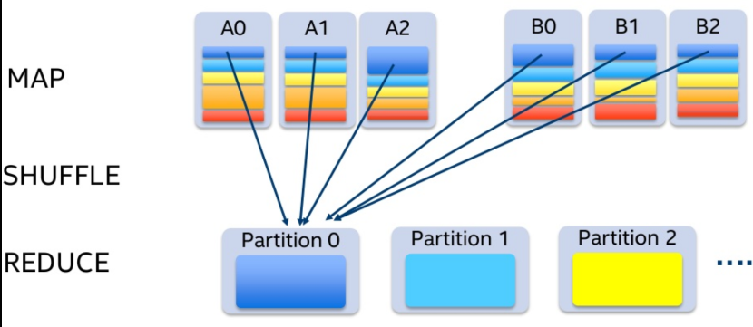
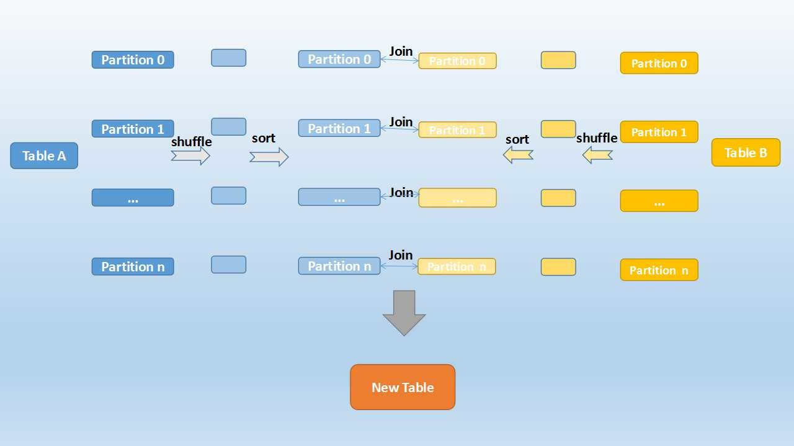

Joins use more shuffles than any other process in Spark. It always leads to bad performance

### Broadcast Hash Join (Map Side Join/ Replicated Join)

* Used when we want to compare a small and large table
* The entire small table is copied into each partition location of the large table
* The table joining happens in the mapper stage itself
* Default: 10 Mb (Max size of small table)

````python
# Force broadcast an table
empDF.join(broadcast(deptDF), empDF.emp_dept_id == deptDF.dept_id, "inner").show()
````



### Shuffle Hash Join

* Used when we join 2 large tables
* The partitions are shuffled to get similar data together (Done for both table)
* And then this shuffled partitions are joined together
* The values that going to be in a partition after shuffle is decided by hash function
* Used for non-indexed data



If we try to join normally for similar data we need to access all the partitions and then are join and reduced into a new partition



### Sort Merge Join

* Used to join very large tables
* Groups the same keys to the same partition
* It is the default sort strategy in Spark since v2.3
* The join key needs to be orderable (sortable) for this algorithm to work



**<u>References</u>**:

* [Joins in Spark SQL- Shuffle Hash, Sort Merge, BroadCast -24 Tutorials](https://www.24tutorials.com/spark/joins-spark-sql-shuffle-hash-sort-merge-broadcast/)