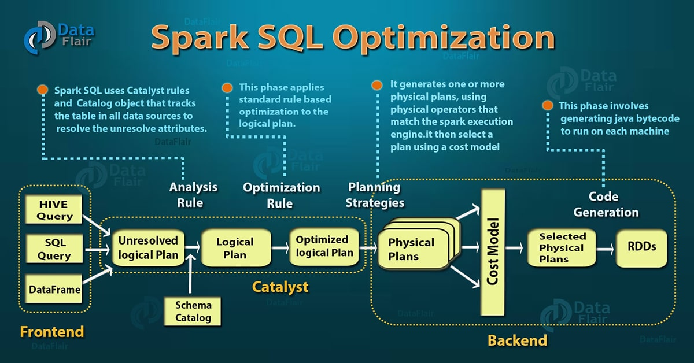

Whatever query that we write is converted into the best physical plan by the Tungsten Engine and optimized using the catalyst optimizer  
Query optimization is only available for build in functions (UDF not supported)

[Spark SQL Optimization - Understanding the Catalyst Optimizer - DataFlair](https://data-flair.training/blogs/spark-sql-optimization/)

Logical Plan (Plan/ code written by the developer)  
Physical Plan (Actual processing that is performed in Spark)

