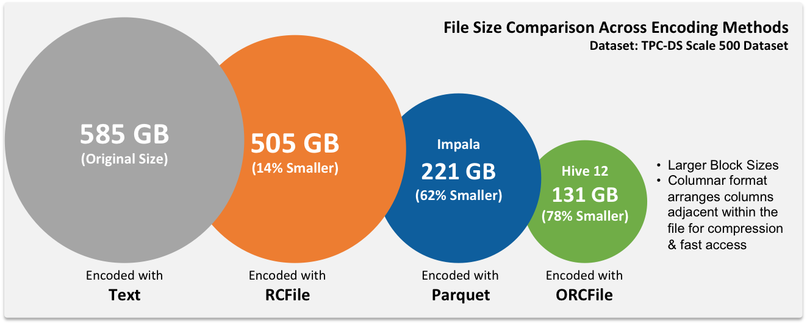

### RCF and ORC

* RCF (Row Columnar File) old not used anymore
* ORC (Optimized Row Columnar) has the highest compressing
* Both the above file formats are by Facebook. And data is stored in columnar form

### Parquet

* Parquet by Cloudera (Used more in industry. Decompression is faster than ORC). Spark uses this format by default
* There is no waste of space in these formats. They don't allocate space for NULL and have an optimized way to handle duplicate data.
* They are faster to read data from compared to textile

### Avro

* Avro (It is a data serialization system native to Hadoop. It is also language independent format)
* .avsc (Avro Schema file) .avro (Avro Data).
* Data internally stored as key, value pair similar to JSON
* Uses RPC for data movement

### Sequence File

Sequence file (Hadoop flat files which stores values in binary key-value pairs)

---

**<u>References</u>**:

* [Hadoop File Formats, when and what to use?](https://nxtgen.com/hadoop-file-formats-when-and-what-to-use)
* [New in Hadoop: You should know the Various File Format in Hadoop. | by Sahil Dhankhad | Towards Data Science](https://towardsdatascience.com/new-in-hadoop-you-should-know-the-various-file-format-in-hadoop-4fcdfa25d42b)
