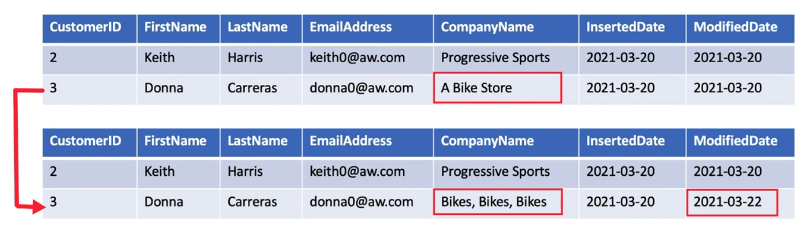
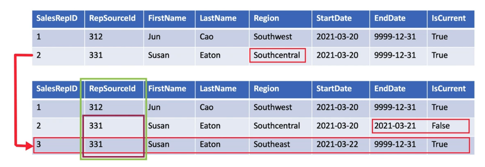
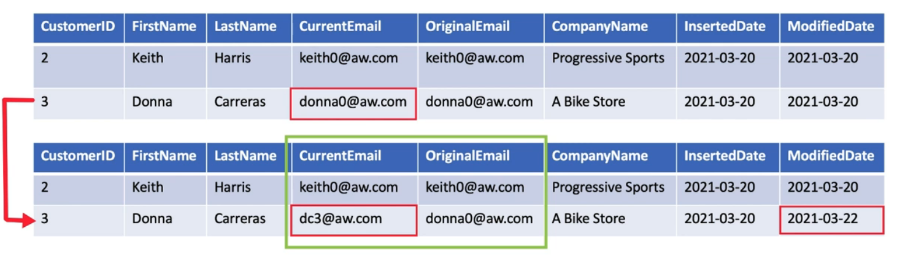
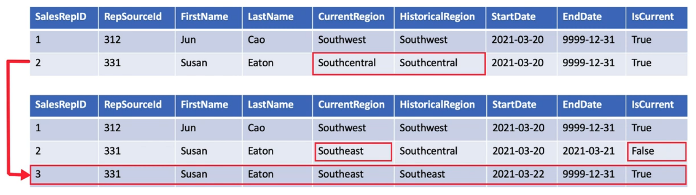

They are the mostly commonly used dimensional technique used in dimensional data warehouses  
When there are fast changing dimensions they are generally stored in the fact table as a measure and the slowly changing dimension is saved in the dimension table only and extra columns are added to keep track of the change

---

### Type 0 (Retain Original)

They are not SCD their values do not change  
Used for capturing original values of the attribute  
Allows to group the records by the original values

### Type 1 SCD (Overwrite)

A type 1 SCD does not store any historic data  
When an change is detected in the source table the value in the dimension table is updated to reflect the change  
It is used for recording supplementary value like Phone Number, Email Address

### Type 2 SCD (Adding Record)

Supports storing versioning of data  
These types of SCD tables table extra columns that are used to capture the validity of the record  
The source table generally do not store versioning data so surrogate keys are used in the dimension table to uniquely identify the change and link it to the primary table

### Type 3 SCD (Add Attribute)

Allows to store only one historic data  
The table will have a column for storing the old value along with the new value  
Type 3 is generally used in combination with Type 1 and Type 2  
Type 3 is suitable when only few column value changes and storing new rows will be too expensive

### Type 4 SCD (Add History Table)

Used when we have quickly changing tables or when the attributes are queried often  
Need creation of a new primary key called surrogate key for the history table  
Sometimes the slowly changing and quickly changing dimensions are stored in different tables (Mini dimensions) and there key is stored in the fact table

### Type 5 (Type 1 + Type 4)

It preserves historic attributes by making use of mini dimensions similar to Type 4 SCD
Use current value to report historic values  
Includes a Type 1 reference in the base table that references the slowly changing and quickly changing dimension

### Type 6 SCD

It is a combination of Type 1, 2 and 3  
Whenever there is an change in value a new row is created similar to Type 2.  
For all the row for the column that is changes the current value is stored as well similar to Type 3  
For each version of the same copy of data the current value can be accessed easily

