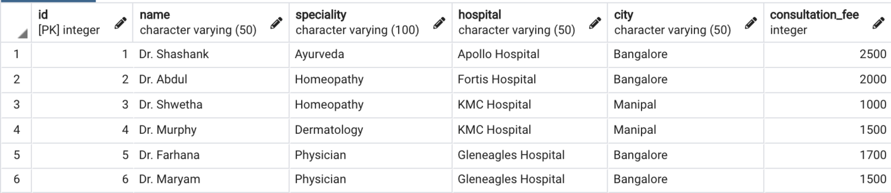
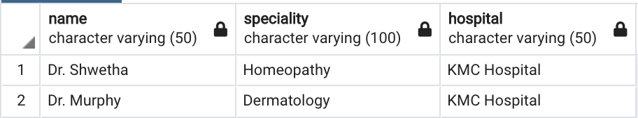

### Fetch the details of doctors who work in the same hospital but in different specialty



<u>Approach</u>  
Whenever we need to compare each record in a table with itself we need to make use of self join  
As we don't want to compare a record with itself extra condition for not checking same ids need to be added



````sql
SELECT d1.name, d1.speciality, d1.hospital
FROM doctors d1
JOIN doctors d2
ON d1.id <> d2.id AND d1.hospital = d2.hospital AND d1.speciality <> d2.speciality
ORDER BY d1.id;
````

---

**<u>References</u>**:

* [Learn how to write SQL Queries(Practice Complex SQL Queries) — techTFQ](https://techtfq.com/blog/learn-how-to-write-sql-queries-practice-complex-sql-queries)
