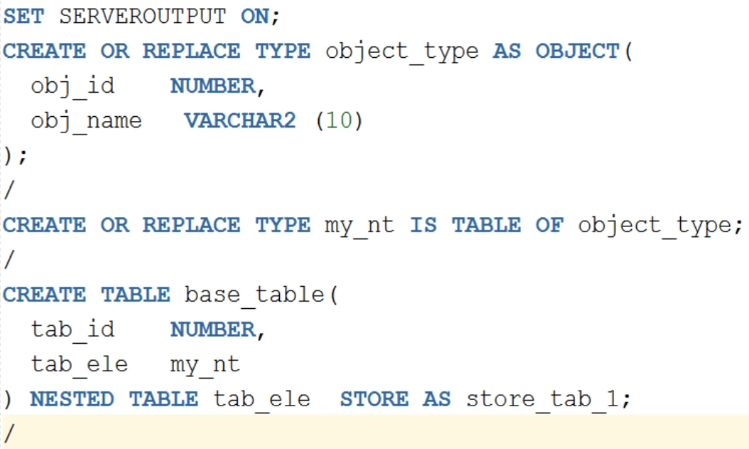

Collections in SQL are one dimensional and are similar to arrays  
VARRAYs have an upper bound on the size


### Nested Table

Similar to array. Index starts from 1  
COUNT can be used to find the size of the nested table  
[How To Create Nested Table As Database Object In Oracle | RebellionRider](http://www.rebellionrider.com/how-to-create-nested-table-as-database-object-in-oracle/#.WNZ32vl97IW)

````plsql
SET SERVEROUTPUT ON;

DECLARE
    TYPE nested_table IS TABLE OF NUMBER;
    v_array nested_table := nested_table(0,1,2,3,4);
BEGIN
    FOR i in 1 .. v_array.COUNT
    LOOP
        DBMS_OUTPUT.PUT_LINE(i || ' => ' || v_array(i));
    END LOOP;
END;
/
````




### VARRAYs

The LIMIT keyword is used to access the upper limit of the VARRAY  
The EXTEND keyword is used to initialize the VARRAY. When used outside the loop we use EXTEND(n) when using inside the loop for dynamic allocation we just use EXTEND  
The values can be directly specified in the initialization step as well

[Introduction To PL/SQL VARRAYs In Oracle Database | RebellionRider](http://www.rebellionrider.com/introduction-to-pl-sql-varrays-in-oracle-database/#.WPm5YdJ9670)  
[How To Create VARRAYs As Database Object In Oracle Database | RebellionRider](http://www.rebellionrider.com/how-to-create-varrays-as-database-object-in-oracle-database/#.WRRci2h9670)

````plsql
SET SERVEROUTPUT ON;
DECLARE
    TYPE varray_type IS VARRAY(10) OF NUMBER;
    new_varray varray_type := varray_type();
BEGIN
    new_varray.EXTEND(10);    
    FOR i in 1 .. new_varray.LIMIT
    LOOP
	 	--new_varray.EXTEND;
        new_varray(i) := i * 10;
        DBMS_OUTPUT.PUT_LINE(new_varray(i));
    END LOOP;
END;
/
````

### Associative Array

Similar to dictionary (key, value) pair from other programming languages

````plsql
SET SERVEROUTPUT ON;
DECLARE
    TYPE ass_array IS TABLE OF NUMBER
    INDEX BY VARCHAR2(20);
    array ass_array;
    counter VARCHAR2(20);
BEGIN
    array('Book 1') := 1234;
    array('Book 2') := 5678;
    array('Book 3') := 91011;
    counter := array.FIRST;
    WHILE counter IS NOT NULL
    LOOP
        DBMS_OUTPUT.PUT_LINE('Key : ' || counter || ' Value : ' || array(counter));
        counter := array.NEXT(counter);
    END LOOP;
END;
/
````

---

### Functions

COUNT: Can be used in For loop as upper bound. Returns the number of elements that are present in the collection (Used with Nested Table)  
EXISTS(n) : Used to check if an value is present at an index  
FIRST, LAST: Returns the first and last element of an collection. Returns NULL if collection does not have value. Error if Index does not exist  
LIMIT: Can be used in for loop as upper bound. Returns the size of the VARRAY  
PRIOR(n), NEXT(n): Returns the previous and next index

### Procedures

DELETE, DELETE(n), DELETE(start, end): Deletes an value at an index from the collection
EXTEND, EXTEND(n), EXTEND(n, v): It is used to assign memory. Attach a single NULL value. Append NULL n times. Append n times the value at index v. Cannot be used with associative arrays  
TRIM, TRIM(n): Remove 1 element from end. Remove n elements from end