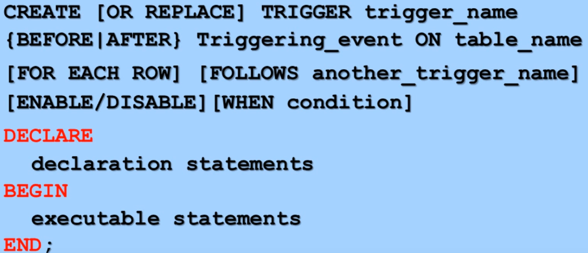
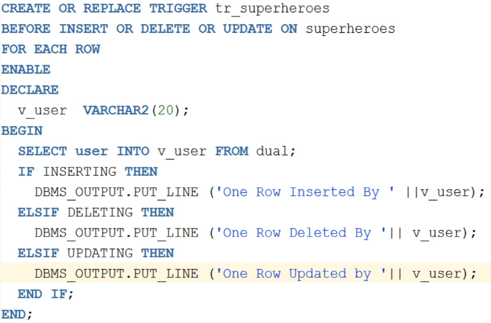
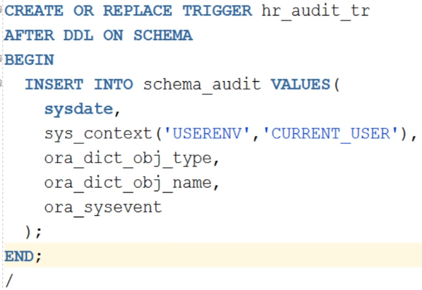
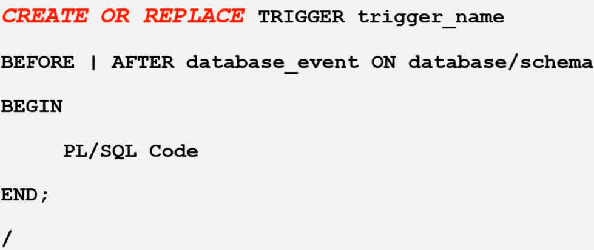
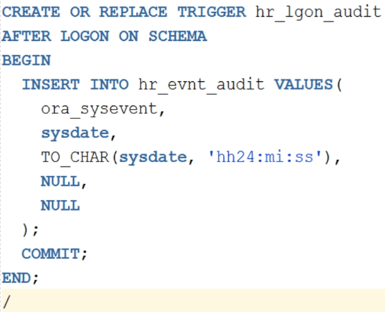
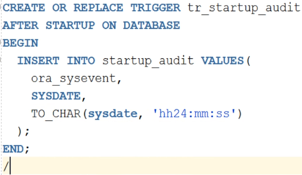
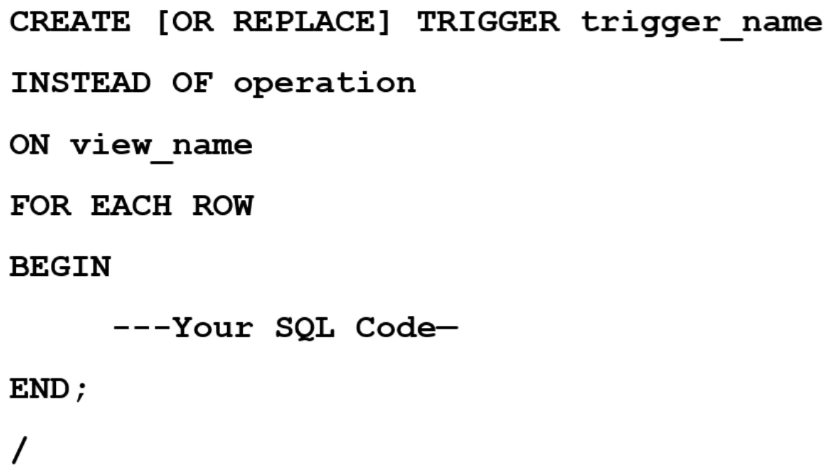
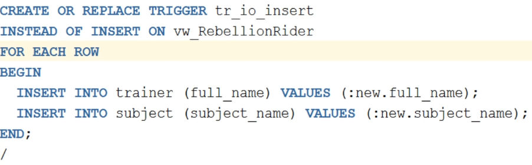
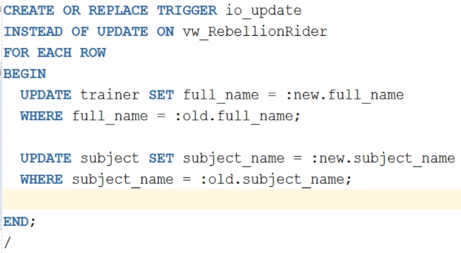
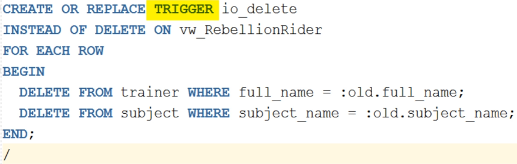

### DML Trigger

### Trigger for Auditing Purposes

`:NEW` and `:OLD` are called as sudo records  
They allow to access an recently changed value or accessed an recently updated or deleted value

### DDL Triggers

### Database Event Trigger

LOGOFF can be used to try when the user exited the Schema  
DB level trigger can be created by using DATABASE and making the trigger using SYSTEM/SYS user

Require to be an SYS/SYSTEM user or have Admin system Trigger privilege

### Instead of Triggers

Can be only used on Views  
Can used to make non updatable views updatable

