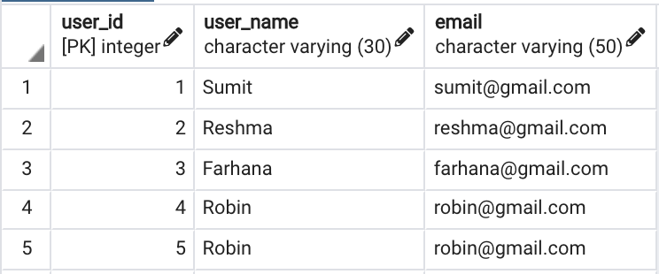
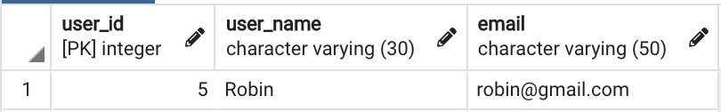
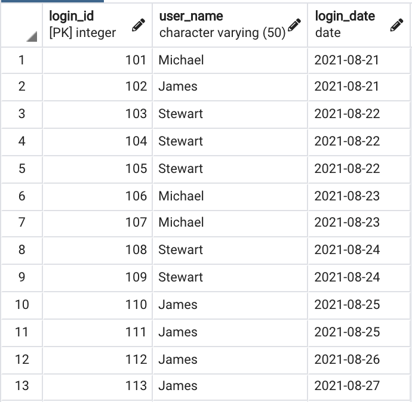
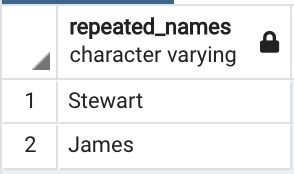
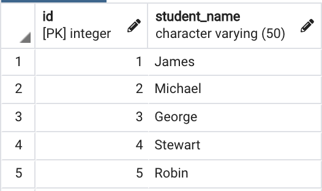
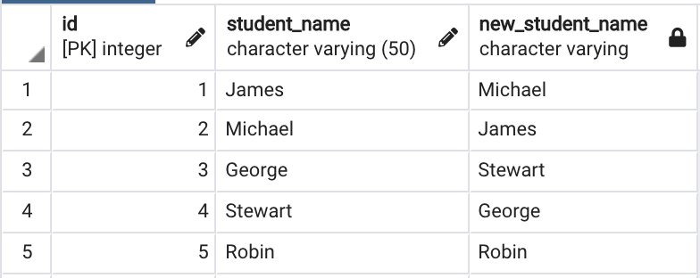
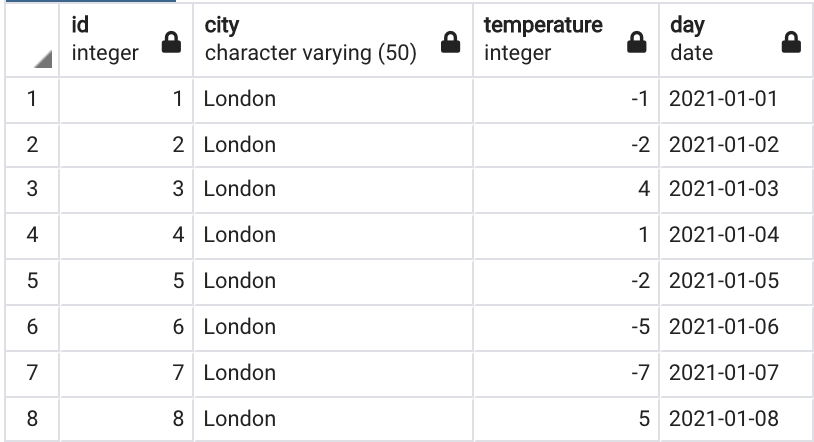
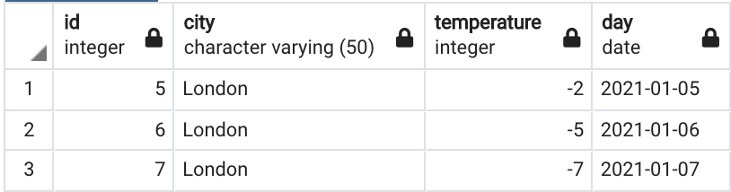

### Fetch all the Duplicate Records in a Table



<u>Approach</u>  
Use ROW_NUMBER() and partition the table by user_name  
If a user exists more than once that the partition will row numbers that are greater than 1

````sql
SELECT user_id, user_name, email
FROM (
	SELECT user_id, user_name, email, ROW_NUMBER() OVER(PARTITION BY user_name ORDER BY user_name) rn
	FROM users
	ORDER BY user_id
) x
WHERE x.rn <> 1;
````



 > [!NOTE]
 > * The `ROW_NUMBER()` function is similar to SEQUENCE() and will return the next incremental number in the series
 > * If same number is required for matching records use the `RANK()` function
 > * [Overview of the SQL ROW_NUMBER function](https://www.sqlshack.com/overview-of-the-sql-row-number-function/)

---

### Fetch the 2nd Last (or Nth) Record from Table

<u>Approach 1</u>  
Use window function and ROW_NUMBER() to assign each row a number  
Fetch the nth record that is required using the above column as reference

````sql
SELECT emp_id, emp_name, dept_name
FROM (
	SELECT *, ROW_NUMBER() OVER(ORDER BY emp_id DESC) rn
	FROM employee
) x
WHERE x.rn = 2;
````

<u>Approach 2</u>  
If Database supports LIMIT clause use its offset parameter to fetch the required record
[SQL Limit: A Beginner's Guide](https://careerkarma.com/blog/sql-limit/)  
**Syntax** : LIMIT(starting_point, rows_to_return) - Count for starting point is from Zero

````
SELECT emp_id, emp_name, dept_name
FROM employee
ORDER BY emp_id DESC
LIMIT 1,1;
````

---

### Fetch 3 consecutive records from a Table



<u>Approach</u>  
When consecutive values from a table need to be compared then mostly the `LEAD()` and `LAG()` function need to be used  
Here we need to check if the next 2 user_names from the current one has the same value for username  
This can be achieved using the `LEAD(scalar_expression, offset, default_value)` function  
Offset and default values are optional parameters  
[MySQL LEAD Function By Practical Examples](https://www.mysqltutorial.org/mysql-window-functions/mysql-lead-function/)

 > [!INFO]
 > * The `LEAD()` and `LAG()` function in MariaDB does not support default_value
 > * [LEAD - MariaDB Knowledge Base](https://mariadb.com/kb/en/lead/)

````sql
SELECT DISTINCT repeated_names
FROM (
	SELECT 
		user_name,
		CASE 
			WHEN user_name = LEAD(user_name) OVER (ORDER BY login_id) AND user_name = LEAD(user_name, 2) OVER (ORDER BY login_id) THEN user_name
			ELSE NULL 
		END repeated_names
	FROM 
		login_details
) x
WHERE x.repeated_names IS NOT NULL;
````



---

### SQL query to interchange the adjacent student names



<u>Approach</u>  
If row number is even then LAG() the name, if even then LEAD the name

 > [!INFO]
 > * The `LEAD()` and `LAG()` function in MariaDB does not support default_value
 > * [LEAD - MariaDB Knowledge Base](https://mariadb.com/kb/en/lead/)

````sql
SELECT
	id, student_name,
	CASE 
		WHEN id % 2 <> 0 THEN LEAD(student_name, 1, student_name) OVER(ORDER BY id)
		WHEN id % 2 = 0 THEN LAG(student_name) OVER(ORDER BY id)
	END new_student_name
FROM
	students;
````



---

### Fetch all the records when London had extremely cold temperature for 3 consecutive days or more



<u>Approach</u>  
Use Window function to find row where its next 2 rows have extreme temperature  
Then write a window function that finds the row above and below the current row that has extreme temperature  
And finally window function to find 2 rows above the current row that have extreme temperature  
This can be implemented using an CASE statement

````sql
SELECT x.id, x.city, x.temperature, x.day
FROM (
	SELECT 
		id, city, temperature, day,
		CASE 
			WHEN temperature < 0 AND LEAD(temperature) OVER (ORDER BY id) < 0 AND LEAD(temperature, 2) OVER (ORDER BY id) < 0 THEN "Y"
			WHEN temperature < 0 AND LEAD(temperature) OVER (ORDER BY id) < 0 AND LAG(temperature) OVER (ORDER BY id) < 0 THEN "Y"
			WHEN temperature < 0 AND LAG(temperature) OVER (ORDER BY id) < 0 AND LAG(temperature, 2) OVER (ORDER BY id) < 0 THEN "Y"
			ELSE NULL
		END flag
	FROM
		weather
) x
WHERE x.flag IS NOT NULL;
````



---

**<u>References</u>**:

* [Learn how to write SQL Queries(Practice Complex SQL Queries) — techTFQ](https://techtfq.com/blog/learn-how-to-write-sql-queries-practice-complex-sql-queries)
