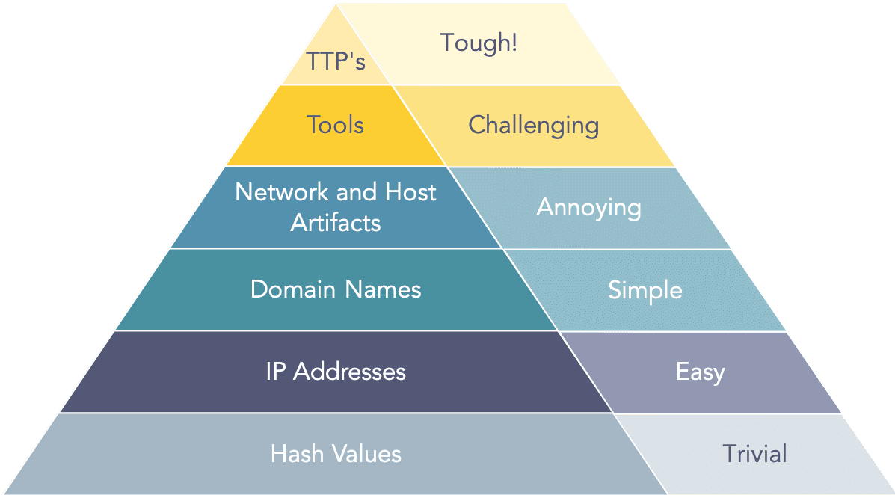
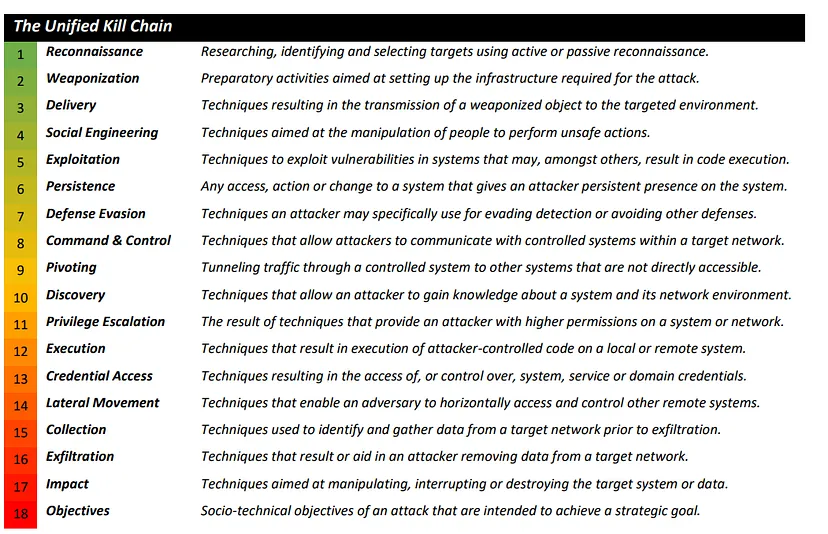

### Pyramid of Pain

The model helps to determine the level of difficulty it will cause an adversary to change the indicators associated with them, and their campaign.

**File Hash (Trivial)**  
Changing even a single character in a file cases the hash to change  
If used as IOC (Indicator of Compromise) can be easily evaded by attacker

**IP Address (Easy)**  
Attackers can use Fast Flux to rapidly change there IP Address  
[Fast Flux 101: How Cybercriminals Improve the Resilience of Their Infrastructure to Evade Detection and Law Enforcement Takedowns](https://unit42.paloaltonetworks.com/fast-flux-101/)

**Domain Name (Simple)**  
Attacker can purchase multiple domains for the campaign  
Punycode can be used to purchase lookalike domains  
URL shorteners can be used to hide the actual Domain Name

**Host and Network Artifacts (Annoying)**  
Attacker will have to circle back and change there attack tools and procedures  
Network Artifacts: Suspicious URLs, Unknown User Agent  
Host Artifacts: Suspicious Process, File Access

**Tools (Challenging)**  
At this stage most attacker might totally give up the attack  
Antivirus Signatures, YARA rules and detection rules can be used  
SSDeep - Fuzzy Hashing - Performs Similarity Matching

**TTPs (Tough)**  
By blocking a attackers TTP the attacker is left with no option but to give up on the attack  
MITRE ATT&CK Matrix

### Lockheed Martin Cyber Kill Chain

**Reconnaissance**: Attacker determines what methods to use to complete/ perform the attack. Uses passive OSINT to gather information on target  

**Weaponization**: Attacker couples payload code (enables access) along with exploit code (exploits vulnerability on system)

**Delivery**: The attacker identifies a vector by which to transmit the weaponized code to the target environment

**Exploitation**: The weaponized code is executed on the target system by this mechanism

**Installation**: This mechanism enables the weaponized code to run a remote access tool and achieve persistence on the target system

**Command & Control (C2)**: The weaponized code establishes an outbound channel to a remote server that can then be used to control the remote access tool and possibly download additional tools to progress the attack

**Actions on Objective**: The attacker typically uses the access he has achieved to covertly collect information from the target systems and transfer it to a remote system (data exfiltration) or archive other goals and motives

Main focus of Framework: Malware Delivery and Network Security  
Does not detect: Insider Attacks  
Improved Version: [Unified Kill Chain: Raising Resilience Against Cyber Attacks](https://unifiedkillchain.com/)

### Unified Kill Chain (UKC)

Phase 1: In - Attacker tried to establish a initial foothold - Make of the 1st 9 stages  
Phase 2: Through - Attack seeks to gain additional privileges -  Covers Stages 9 to 14  
Phase 3: Out - Action of Objective of Attack - Covers Stages 15 to 18

### Diamond Model of Intrusion Analysis

A framework for analyzing cybersecurity incidents and intrusions by exploring the relationship between four core features: adversary, capacity, infrastructure and victim

### MITRE ATT&CK Framework

A knowledge base mentioned by MITRE for listing and explaining adversary tactics, techniques and procedures

The pre-ATT&CK tactics matrix aligns to the reconnaissance and weaponization phase of the kill chain
