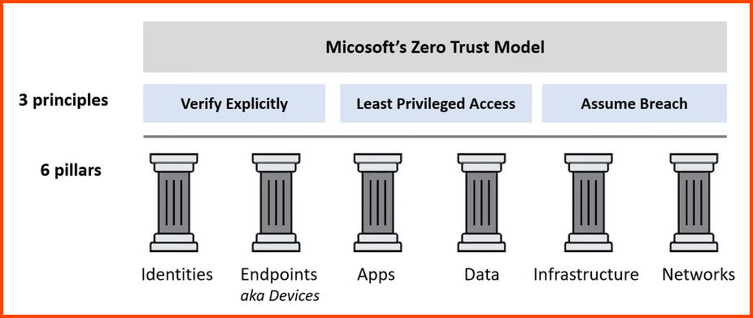

Trust no one, verify everything

6 Pillars: IDEA-IN  
3 Principles: LAV

### Defense in Depth

Data: Encryption  
Application: Secure & free of vulnerability  
Compute: Access to VM  
Network: Limit communication using segmentation & access control  
Perimeter: DDoS Protection  
Identity & Access: Controlling access to Infrastructure  
Physical: Limit access to Datacenter
