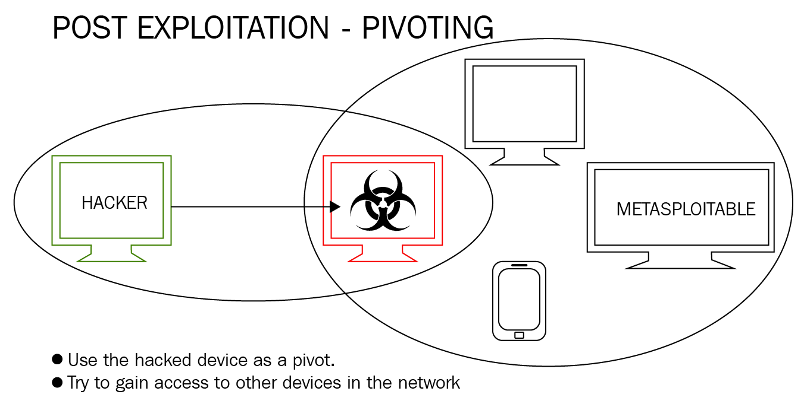

Using the hacked device try and gain access to other devices on the network  
We can setup an route between hacker and hacked device  
Now hacker can access devices on the network  
Once we setup route we can use any Metasploit module on target network



#### Autoroute

````bash
use post/multi/manage/autoroute
show options
````

SESSION : Current listening session  
SUBNET : Subnet of pivoting network

The older version of autoroute can be run from the metaoperator session also

---

### LaZagne Project

Lazagne is a post exploitation tool that is used to gather information about the target system

**Commands**:  
lazagne --help  
lazagne browsers : Show passwords that are saved in browser  
lazagne all : Run all the modules