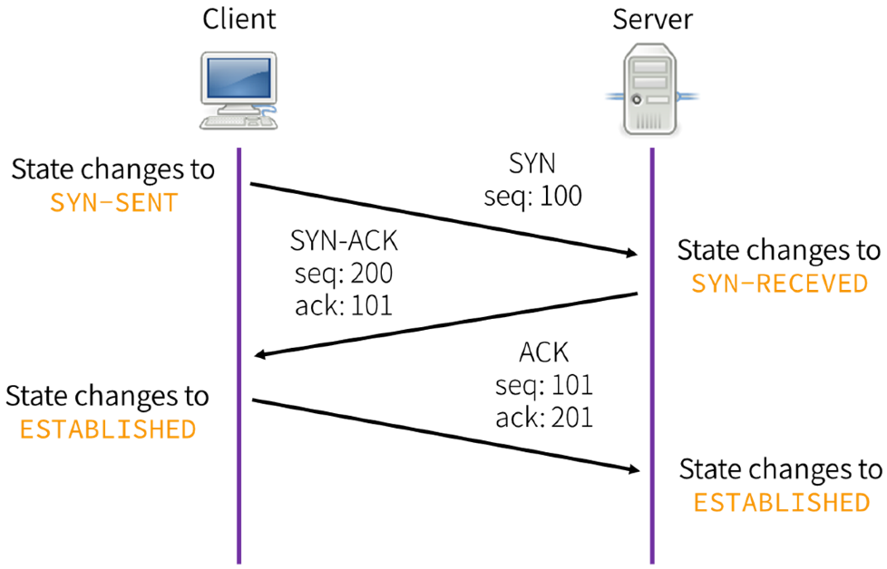

### TCP Header Flags

| Flags                 | Description                                    |
| --------------------- | ---------------------------------------------- |
| SYN (Synchronization) | Initializes connection between host and target |
| ACK (Acknowledgment)  | Acknowledges receipt of packet                 |
| PSH (Push)            | Transmits data immediately                     |
| URG (Urgent)          | Packets to be processed immediately            |
| FIN (Finish)          | No further transmission                        |
| RST (Reset)           | Resets the connection                          |

TCP Header without any of the options is 20 bytes  
The options are only shared between the client and server during the initial Handshake

---

[TCP (Transmission Control Protocol)](../../../Networking/TCP-IP%20Layers/4%20-%20Transport%20Layer%20Protocols/TCP%20%28Transmission%20Control%20Protocol%29.md)