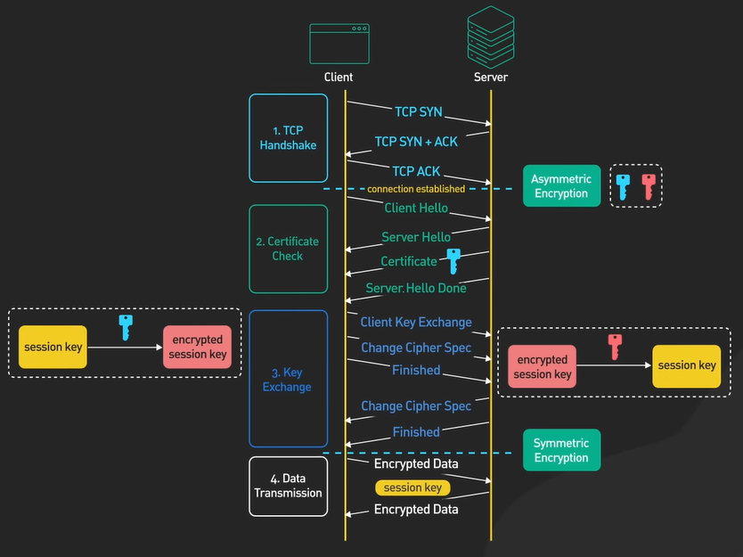

It is a stateless application layer protocol  
Used for the transmission of resources (HTML, CSS, JS, etc.) over TCP connection  
Uses client server model for communication  

Resources are uniquely identified using a URL/ URI

---

### HTTPS Connection Setup

**Step 1**:  
[TCP (Transmission Control Protocol)](../../Networking/TCP-IP%20Layers/4%20-%20Transport%20Layer%20Protocols/TCP%20(Transmission%20Control%20Protocol).md)  
[TCP Three-Way Handshake](../Tools%20&%20Services/Nmap/TCP%20Three-Way%20Handshake.md)

**Step 2**:  
Client Hello: TLS Version, Cipher Suite Supported, etc.  
Certificate: Public Key of Server

Client verifies the certificate using its Certificate Authority (CA) to ensure its valid

**Step 3**:  
*There a different ways to complete this step the easiest is using RSA algorithm*  

Client encrypts session token using Public Key of Server  
Server received packet and decrypts using its Private Key  

TLS 1.3 does not support RSA and instead using Diffie-Hellman Algorithm

**Step 4**:  
Encrypted Communication between Server and Client  
Symmetric Encryption is used has it is computationally less expensive for sharing continous streams of data  

---

### HTTP Versions

<u>HTTP 1.0</u>  
Reset Connection after every request

<u>HTTP 1.1</u>  
Keep connection open until all resources are fetched  
Can only fetch single resource at a time

Added support for pipelining which allows client to send multiple requests at once
The request also had to be received in the same order  
Was difficult to implement and had other issues (Head-of-line Blocking) hence was eventually removed

<u>HTTP 2.0</u>  
Added Streams which allows to send multiple streams of data in a single TCP connection  
Each stream is independent of each other and can be received in any order  
Allows to request multiple resources at the same time

<u>HTTP 3.0</u>  
New protocol that uses [QUIC](../../Networking/TCP-IP%20Layers/4%20-%20Transport%20Layer%20Protocols/QUIC%20%28Quick%20UDP%20Internet%20Connections%29.md) instead of TCP  
QUIC is based on [UDP](../../Networking/TCP-IP%20Layers/4%20-%20Transport%20Layer%20Protocols/UDP%20%28User%20Datagram%20Protocol%29.md) protocol  
All quick streams share the same connection and hence multiple handshakes are not required  
QUIC has an concept of Connection ID which allows uses to switch networks quickly and reliably

---

### HTTP Requests

Sample Request : `GET /home.html HTTP/1.1`

HTTP Method : Used to specify what the client should do  
HTTP Version : Version of HTTP  
Path : Location of file/ document  
HTTP Headers

### HTTP Responses

Sample Response : `HTTP/1.1 200 OK`

HTTP Version : Version of HTTP  
Status Code : Code specifying the status of the request  
HTTP Headers

---

**<u>References</u>**:

* [Web App Penetration Testing - Introduction To HTTP - YouTube](https://www.youtube.com/watch?v=TvRyJmPjcbw)
* [HTTP headers - HTTP | MDN](https://developer.mozilla.org/en-US/docs/Web/HTTP/Headers)
* [HTTP Headers for Dummies](https://code.tutsplus.com/tutorials/http-headers-for-dummies--net-8039)