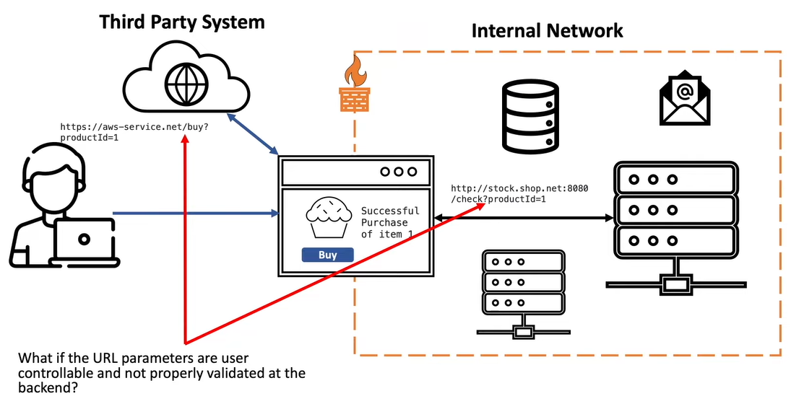
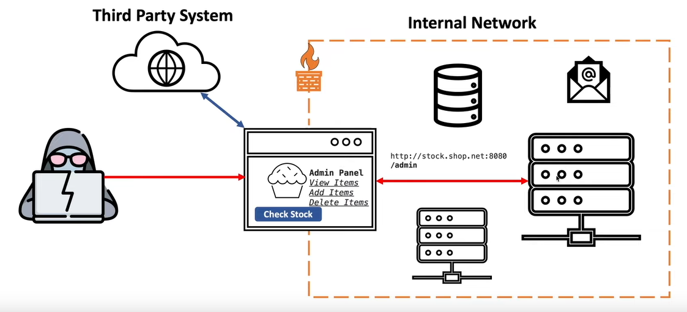

### Example System

Main Application (Cookie Store) that depends on a internal service for checking existence/ count of cookies, additionally the application also uses a service running in AWS to process orders. Whenever the main application speaks to one of the external service it passes the URL of the external service as a parameter.

The Internal Services and Third Party Services have a trust relation with the main application. So any request sent from the main application will be accepted by the auxiliary services.

If the URL parameters in the requests are not validated in the backend, a user an pass a URL that could expose details stored on a internal service.

We cannot interact with the Admin Panel from our browser is it will be seen as a external request and get blocked by the firewall. Instead we can exploit the SSRF vulnerability again and change the URL to the value that would have been passed if the buttons on the admin page was clicked

### Impact of SSRF

The SSRF vulnerability can also be used to run a **automated Network Scan** to find other vulnerable devices on the network  
SSRF could also be used in cloud environments to find details of IAM rules that have excessive access and use that to steal information  
SSRF can lead to sensitive information disclosure, scan of internal network, compromise of internal services, remote code execution, etc.

### Definition

SSRF is a class of vulnerabilities that occurs when a service is fetching a remote resource without properly validating the user inputs provided by the user, this allows the attacker to coerce the service to make network connections on behalf of the attacker and potentially target systems that are behind firewalls. 

> [!HINT]  
> If an application sends an **URL** or **Hostname** as **parameter** it definitely needs to be tested for **SSRF**

### Types of SSRF Attacks

#### Regular/ In-Band SSRF
User can tamper with the URL in the request and the response to the requested URL will be displayed back in the application

#### Blind/ Out-of-Band SSRF
The application does not provide the response back in the application. In this case the application needs to be forced to make a DNS or HTTP request to a server controlled by the attacker in order to prove the existence of a vulnerability

### Finding SSRF Vulnerabilities

#### Black Box Perspective

- **Mapping the Application**: Identify any request parameter that contains hostnames, IP Addresses or Full URLs
- **Regular SSRF Fuzzing**: Modify the request parameters to specify an alternative resource and see how application responds
	- If there is any defense in place try to circumvent it using known techniques
- **Blind SSRF Fuzzing**: Modify the value of the request parameters to a server on the internet that we control and monitor and server for incoming requests
	- If no incoming connections are received, monitor the time taken by the application to respond

#### White Box Perspective

- Review source code and identify all request parameters that accept URLs
	- This could be done by combining both a black box or white box perspective
- Determine which URL parser is being used and if that can be bypassed
	- Find other defenses being used and try to bypass them

### Exploiting SSRF

#### Regular SSRF

- If application allows for user specified arbitrary URLs
	- Try if port numbers can be specified
	- If successful attempt to port scan internal networking using Burp Intruder
	- Attempt to connect to other services on the loopback address
- If application does not allow for user specified arbitrary URLs (Defenses in place)
	- Use different encoding schemes
	- Register a domain name the resolves to internal IP Address (DNS Rebinding)
	- Use own HTTP server that redirects to internal IP Address (HTTP Redirection)
	- Exploiting inconsistency in URL parsing

#### Blind SSRF

- Attempt to trigger an HTTP request to an external system we control and observe network for any interaction
	- Can be done using Burp Collaborator
- If defenses are in place use same obfuscation approaches used for Regular SSRF

### Defenses against SSRF

#### Application Layer Security

- Sanitize and validate all client-provided user inputs
- Enforce the URL schema, port and destination with a positive allow list (Whitelist)
- Do not send raw responses to client
- Disable HTTP redirects

> [!TIP]
> We should never use a black list or regex to define the services that can be accessed by the application. These lists can easily be bypassed by encoding the payload

#### Network Layer Security

- Segment remote resource access functionality in separate networks to reduce the impact of SSRF
- Enforce "deny by default" firewall policies for intranet traffic

### References

- [Server-Side Request Forgery (SSRF) | Complete Guide - YouTube](https://www.youtube.com/watch?v=ih5R_c16bKc&t=914s)
- [A New Era of SSRF - Exploiting URL Parser in Trending Programming Languages! - YouTube](https://www.youtube.com/watch?v=voTHFdL9S2k)