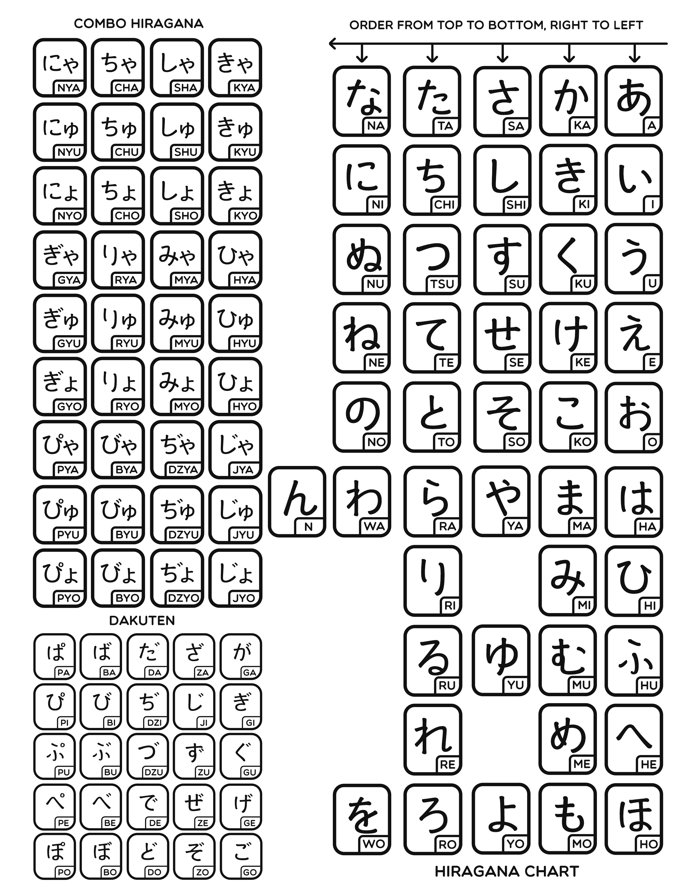

Hiragana and Katakana characters together is called as Kana  
Each Kana character only produces one sound

Hiragana is the most commonly used script in Japanese it is used for functional words (grammatical particles) it is also used at the end of adjectives and verb  
There are 5 vowels, 40 consonant + vowel pair and 1 consonant (101 syllable sounds)

[Hiragana Character Guide](https://www.learn-japanese-adventure.com/hiragana-chart.html)

---

### Hiragana Chart

* [Hiragana Vowels](Hiragana%20Vowels.md)
* [Hiragana K-Column](Hiragana%20K-Column.md)
* [Hiragana S-Column](Hiragana%20S-Column.md)
* [Hiragana T-Column](Hiragana%20T-Column.md)
* [Hiragana N-Column](Hiragana%20N-Column.md)
* [Hiragana H-Column](Hiragana%20H-Column.md)
* [Hiragana M-Column](Hiragana%20M-Column.md)
* [Hiragana Y-Column](Hiragana%20Y-Column.md)
* [Hiragana R-Column](Hiragana%20R-Column.md)
* [Hiragana W-Column & N](Hiragana%20W-Column%20&%20N.md)

