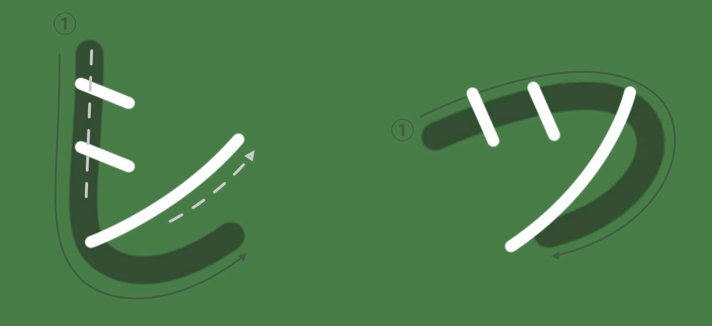

### T-Column

タ (ta) : Person holding a **Ta**blet  
ダ (da)

チ (chi) : **Chi**cken/ **Che**erleader  
ヂ (ji)

 > [!INFO]
 > `ヂ` is rarely used in Japanese

ツ (tsu) : **Tu**na Fish  
ヅ (zu)

We can remember the stroke order for Katakana "shi" and "tsu" using the Hiragana counterpart

The "chisaii tsu" is present in Katakana as well and serves a similar purpose as the Hiragana version

テ (te) : **Te**lephone Pole  
デ (de)

ト (to) : **To**tem Pole sideview  
ド (do)

---

### T-Column Digraphs

チェ (che)

 > [!INFO]
 > `チェ` is used to words like `チェア` (chair) and `アーチェリー` (archery)

ティ (ti)  
ディ (di)

トゥ (tu)  
ドゥ (du)

 > [!INFO]
 > The above digraphs where created as Japanese does not have the "ti" and "tu" sound

---

### Word Examples

* タイ
	* Tai (Thailand)
* チーズ
	* Chīzu (Cheese)
* デート
	* Dēto (Date)
* ドイツ
	* Doitsu (Germany)
* スイッチ
	* Suīchi (Switch)
* サッカー
	* saakā (Soccer/ Football)
* アウトドア
	* Autodoa (Outdoor Activities)
* ジェットコースター
	* Jittokōsutā (Roller Coaster)