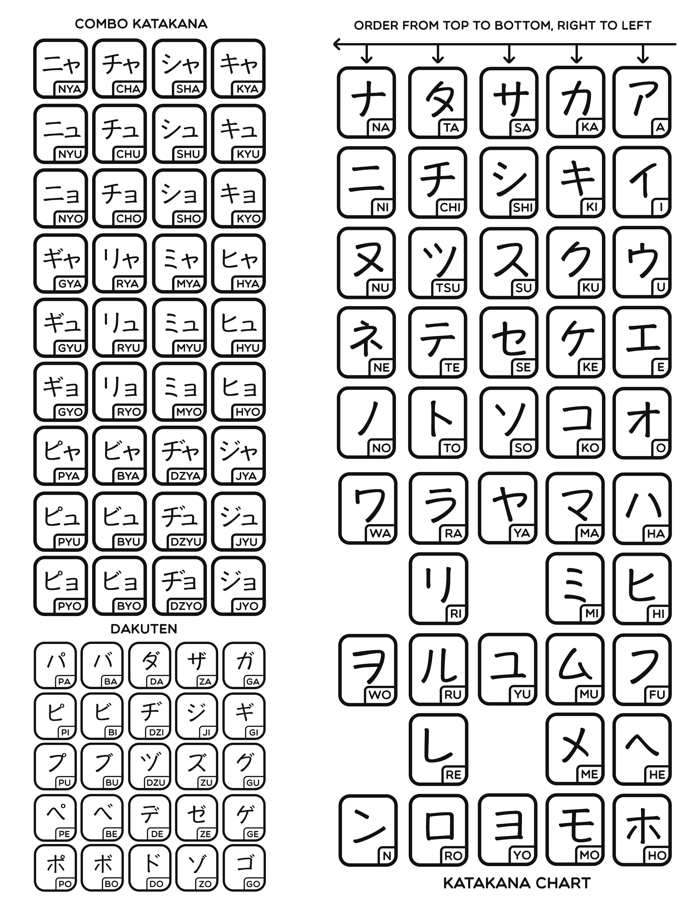

Katakana characters have the same sound as Hiragana  
They are used to represent Loan Words (Foreign Words), Western Names  
Loan words may sound different when said in Japanese as it will be pronounced using the Japanese syllabary

It is also used to show Emphases in Sentences (Equivalent to Italics in English)  
It is also used to represent Onomatopoeia (Sound Effects)

[Katakana Chart Guide](https://www.learn-japanese-adventure.com/katakana-chart.html)

---

Some loan words are so popular in Japanese that they end up becoming adjective or verb

* シェアする
	* Sheasuru (To share)
* スマート
	* Sumaato (Smart-Looking)
* サボる
	* Saboru (To slack off)

---

### Katakana Chart

* [Katakana Vowels](Katakana%20Vowels.md)
* [Katakana K-Column](Katakana%20K-Column.md)
* [Katakana S-Column](Katakana%20S-Column.md)
* [Katakana T-Column](Katakana%20T-Column.md)
* [Katakana N-Column](Katakana%20N-Column.md)
* [Katakana H-Column](Katakana%20H-Column.md)
* [Katakana M-Column](Katakana%20M-Column.md)
* [Katakana Y-Column](Katakana%20Y-Column.md)
* [Katakana R-Column](Katakana%20R-Column.md)
* [Katakana W-Column & N](Katakana%20W-Column%20&%20N.md)

