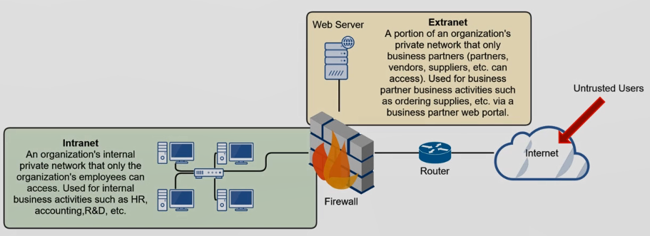

**Internet** : Collection of Collected Networks, Untrusted, WAN

**Intranet** : Internal Private Network. Used for internal business. Outside users (Internet, Extranet) cannot access resources on the Intranet

**Extranet** : Private network that only business partners an access. Only accessible from Intranet and Extranet

