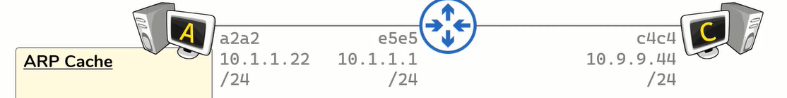

### Same Network

Each Host has an NIC and hence has an [MAC (Media Access Control) Address](../TCP-IP%20Layers/2%20-%20Data%20Link%20%28Network%20Interface%29%20Protocols/MAC%20%28Media%20Access%20Control%29%20Address.md)  
The Host will also have an IP Address and a Subnet Mask  
Host A acquires the IP Address of Host B (There are multiple ways to acquire the IP)  
Then Host A checks if Host B is on the same network as itself (This is done by looking at the Subnet Mask)  
Once Host A identifies that Host B is on the same network as itself it will encapsulate the data by generating a Layer 3 Packet that contains the Source and Destination IP Address  
Layer 3 cannot directly talk with the wire so the packet needs to be converted into a Layer 2 frame  
In this Layer the Source and Destination MAC Address is required as Host A does not have the MAC Address of Host B it uses [ARP (Address Resolution Protocol)](../TCP-IP%20Layers/2%20-%20Data%20Link%20%28Network%20Interface%29%20Protocols/ARP%20%28Address%20Resolution%20Protocol%29.md)

Once it receives the MAC Address it can construct the Layer 2 frame and send it over the wire  
Every subsequent connection between Host A and Host B can happen easily as all the necessary information are known by both Host  
This process remains the same even if there and Switches and Hubs on the network

---

### Foreign Network

Host A want to communicate with Host C, Host A knows the IP Address of Host C and by looking at the Subnet Mask is able to identify that Host C is on a foreign network  
Host A creates the Layer 3 Packet using the source and destination IP Address  
Since Host C is on a foreign network Host A understands that the next hop that the packet has to be sent is the Router of its network  
Host A does not know the MAC Address to the Router and uses ARP for the same (Host A already knows the IP Address of the Router as it is configured as its Default Gateway)

Once Host A receives the MAC Address it creates the Layer 2 frame and sends the packet to the Router  
Once the packet is received it discards the Layer 2 header and adds new Layer 2 headers as required for the packet to reach Host C

---

[Networking](../Networking.md)