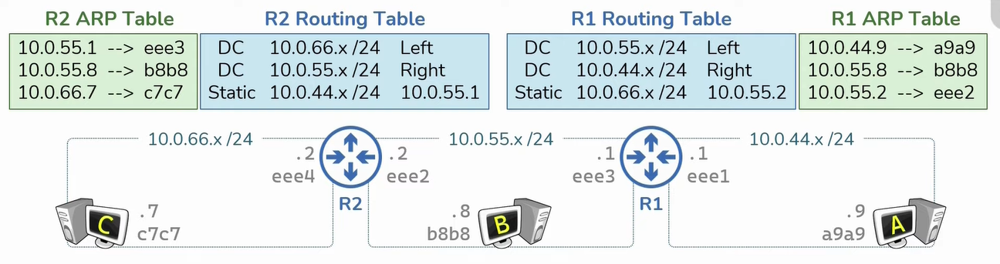

Used to facilitate communication between different networks  
Routers have a IP Address and MAC Address for each of its interface  
It learns which networks are connected to each of its interfaces

Router consist of routing tables which stores info on how to route information across the networks. They also have an ARP Table  
ARP Tables start out empty and are populated as traffic flows through the network while Routing Tables have be configured before it can be used  
When an router receives an packet with an unknown destination IP the packet is dropped

Routing Tables can be populated via three approaches:

* **Directly Connected**: Routes for networks which are attached (WAN and LAN interface)
* **Static Routes**: Routers that are manually entered by a Administrator
* **Dynamic Routes**: Routes that are automatically learned from other Routes. [Dynamic Routing Protocols](../TCP-IP%20Layers/3%20-%20Network%20%28Internet%20Layer%29%20Protocols/Dynamic%20Routing%20Protocols.md) are used to share these Routes

 > [!INFO]
 > The content that is added into the routing table by **static** routing and **dynamic** routing is exactly the same the only difference is the way the information is learned

Command: `route print`