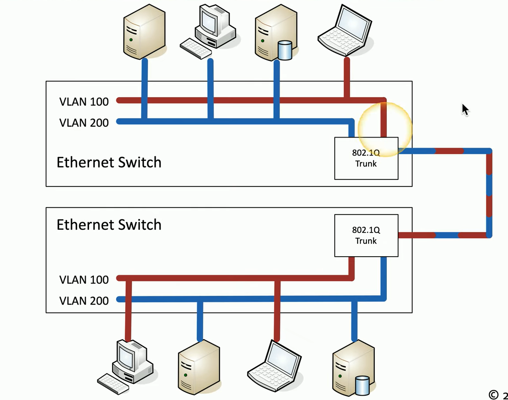

Break large physical LAN into smaller logical LANs  
This feature can be configured on managed switches  
Assigns specific switch interfaces (ports) on the switch to specific VLANs (Port 1, 2, 3 - VLAN 100 and Port 4, 5, 6 - VLAN 200, etc.)

VLANs reduce broadcast domain (Packet broadcast that occurs the 1st time MAC is added into switch table)  
Allows to Segments network by role (HR, Sales). Increases security. Devices cannot communicate with outer VLANs

VLANs can span multiple physical switches. And these VLANs on different switches can be joined together using Ethernet.  
Functionally this is an viable solution but it does not scale well when there are multiple VLANs (A lot of ports will be used up just to link the switches together)

An alternative is to used **<u>Trunking</u>** (802.1Q) which allows a single interface on the switch to act as a bridge for all the VLANs (Trunk Link)  
When a packet is sent over the Trunk in the Ethernet Packet an extra header called the VLAN header which does info on which VLAN the packet should go

ISL (Inter-Switch Link) an older standard that was used to trunk information between switches