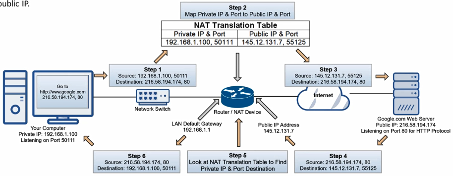

Converts Private IP Address to Public IP Address  
Allows to map multiple private IP Addresses to a single public IP

<u>Working</u>  
Router has 2 interfaces - public interface (Assume 145.12.131.7) and private interface (Default Gateway)  
Search for google.com (215.58.194.174,80) we are making an HTTP request to google server for this we need to open an high dynamic port on our device (Assume 50111)

**Step 1**: Send request to Google server at port 80 from our device (Assume 192.168.1.100) on port 50111. We are listening for response on port 50111  
**Step 2**: NAT maps private IP and port to public IP and port. This information (mapping) is stored in the NAT translation table  
**Step 3**: Router will forward the packet to google web server using the public IP address and public high dynamic port  
**Step 4**: Google sends back reply on our public IP address for the public high dynamic port from its IP and port 80  
**Step 5**: On our router NAT looks for the mapping for the incoming request  
**Step 6**: The packet is forwarded to the appropriate device on the LAN

---

### Types of NAT

* **Static NAT (SNAT)** : One Public IP mapped to one Private IP statically
* **Dynamic NAT (DNAT)** : Maps single private IP Address to a single public IP Address  (Modifies Layer 3 header). If there are multiple private IPs then a similar amount of public IP Addresses also required for translation. The private IP is assigned dynamically to the private IP.
* **PAT (Port Address Translation)** : Type of DNAT. Maps multiple private IP Address with a single public IP Address by changing the IP Address & port numbers (Modify Layer 3 & Layer 4 headers). It is also called port overloading, Network & Port Translation (NAPT) & IP Masquerading