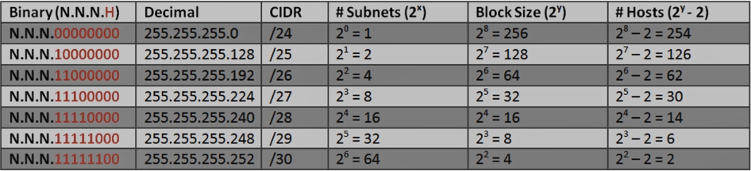
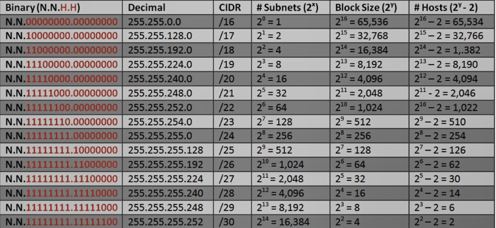
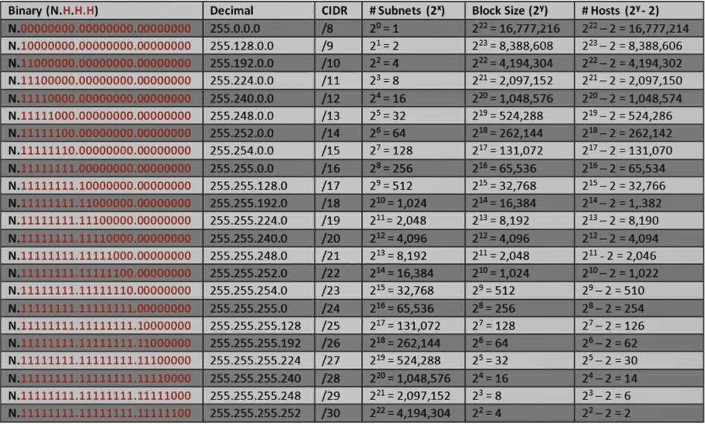

Using default Class A, B and C subnets (Classful IP Addressing) is inefficient  
It wastes unused IP Addresses (Public IP Addresses)

Subnetting allows to create multiple logical networks that exist within a single Class A, B or C network (Classless Subnet)

It also allows for more efficient routing via router summarization (The routing tables do not have to store data for an large network so routing tables won't be large)

---

### Fixed Length Subnetting

Also called Fixed Length Subnet Mask (FLSM)  
We borrow host bits to create more sub-networks from a Class A, B or C network  
While we end up creating more networks the amount of host IP addresses available to use reduces  
Each bit we borrow is equal to $2^1$ subnets

| Field            | Value                                                                                                                                                                                                            |
| ---------------- | ---------------------------------------------------------------------------------------------------------------------------------------------------------------------------------------------------------------- |
| IP Address       | 169.174.141.10 10101001.10101110.10001101.00001010                                                                                                                                                           |
| Subnet Mask      | 255.255.255.240 11111111.11111111.11111111.11110000                                                                                                                                                          |
| Network ID (XOR) | 10101001.10101110.10001101.00000000 169.174.141.0                                                                                                                                                            |
| Host ID          | Last 4 bits identify Host ID therefore $2^4$  = 16 available host but only 14 are usable host 1st one is the Network ID (169.174.141.0) The last one is used as Broadcast IP (169.174.141.15) |
| Usable Hosts     | 169.174.141.1 - 169.174.141.14                                                                                                                                                                                   |
