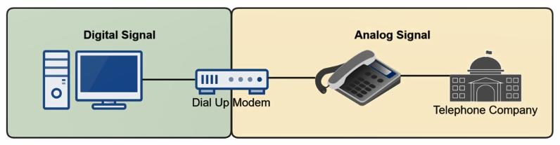

The original connection methodology (56Kbps maximum speed)  
Uses POTS (Plain Old Telephone Services) also called as PSTN (Public Switched Telephone Network)  
An telephone connection was required for this technology to work  
Makes use of an Dial Up Modem to convert digital signal from PC to analog signal that goes to the telephone company where circuit switching is used

 > [!INFO]
 > Using this technology we cannot use the phone and the internet at the same time