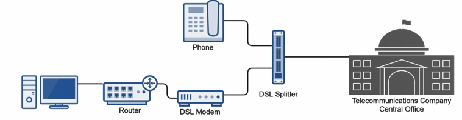
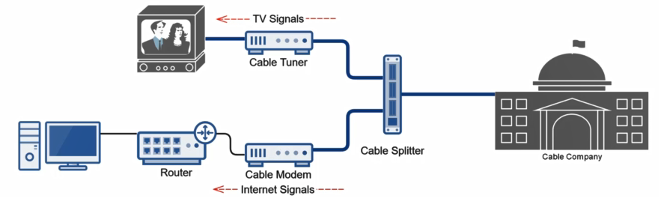

High speed internet using POTS (Sends data digitally over telephone line)  
Uses a DSL modem and splitter to accomplish this task  
(Limitation) DSL modem must be within 2 miles of telecommunication company  
It's an hybrid technology as the connection to the telecommunication company can be circuit switched (normal speed connection) or packet switched (high speed connection)

Types of DSL:

1. <u>Symmetric DSL (SDSL)</u>  
   Equal bandwidth for upstream and downstream data flows (Office Users)  
   1.544Mbps (US and Canada) - T1 Equivalent  
   2.048Mbps (Europe) - E1 Equivalent

2. <u>Asymmetric DSL (ADSL)</u>  
   Allocates more bandwidth for downstream than upstream (Home Users)  
   1.544 to 6.1Mbps Downstream and 16 to 640Kbps Upstream

3. <u>Very High Bitrate DSL (VDSL)</u>  
   An subset of ADSL used generally in offices  
   53Mbps Downstream and 2.3Mbps Upstream

4. <u>Broadband Cable</u>  
   High speed Internet technology utilizing your cable service (Internet over TV cable)  
   Uses Data Over Cable Service Interface Specification (DOCSIS) standard to provide Internet access  
   Multiple signals over different frequencies at the same time in the cable (Do to different frequencies we can have multiple channels (each channel 1 frequency) and a different frequency for Internet)  
   It makes use of packet switched network

| DOCSIS Version  | Max Download Speed | Max Upload Speed |
| --------------- | ------------------ | ---------------- |
| 1.0             | 40Mbps             | 10Mbps           |
| 1.1             | 40Mbps             | 10Mbps           |
| 2.0             | 40Mbps             | 30Mbps           |
| 3.0             | 1.2Gbps            | 200Mbps          |
| 3.1             | 10Gbps             | 1Gbps            |
| 3.1 Full Duplex | 10Gbps             | 10Gbps           |

 > [!NOTE]
 > 3.0 onward are the newer standards that are available
