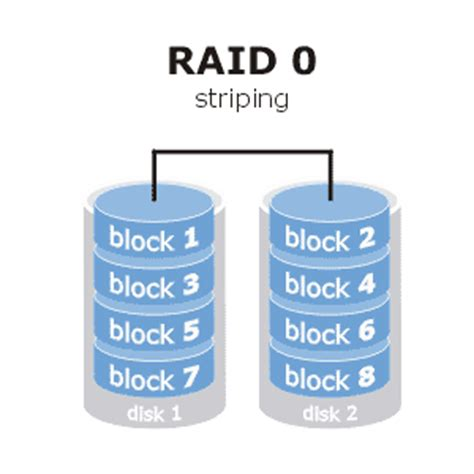
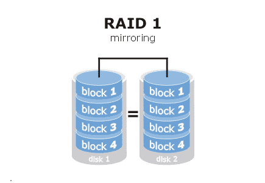
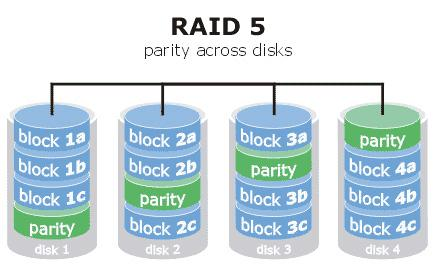
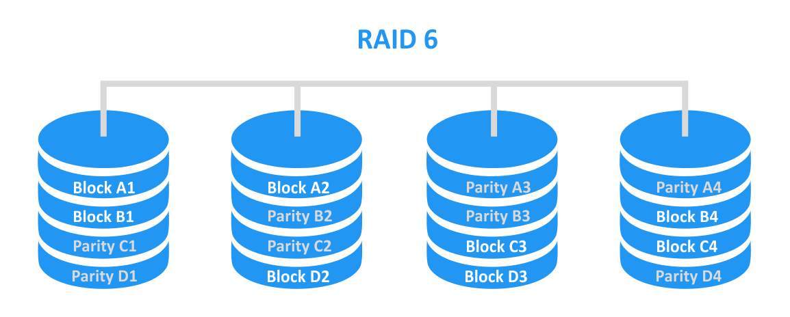
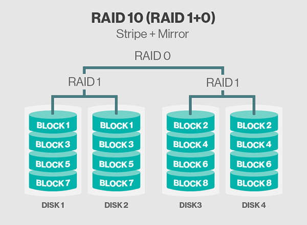

Redundant Array of Independent Disks  
Data is copied or spread across multiple disks

---

### RAID 0 : Stripping

Not Fault Tolerant  
Data is stripped across multiple disks  
Advantage is speed

---

### RAID 1 : Mirroring

Fault Tolerant  
Data is copied on more than 1 disk

---

### RAID 5 : Striping & Distributed Parity

Requires 3 or more disk  
Commonly used Setup  
Data is stripped evenly across multiple disk along with parity  
Parity is used to rebuild disk in case of failure  
Can handle a single disk failure  
The equivalent of an entire disk is used to store parity

---

### RAID 6 : Stripping & Double Distributed Parity

Requires 4 or more disks  
Data and parity is evenly spread across the disks  
Unlike RAID 5 the parity is spread twice on all disks  
Can handle 2 disks failure  
The equivalent of 2 entire disk is used to store parity  
RAID 6 writes data slower than RAID 5 become it has to write 2 parity bits

---

### RAID 10 : Mirroring & Stripping

Requires a minimum of 4 disks  
Set of 2 disks are mirrored using RAID 1  
And both sets are stripped using RAID 0  
Provides Speed of RAID 0 and Fault Tolerance of RAID 1  
Only 50% of the storage can be used to actually store data

---

[Operating System](../Operating%20System.md)
