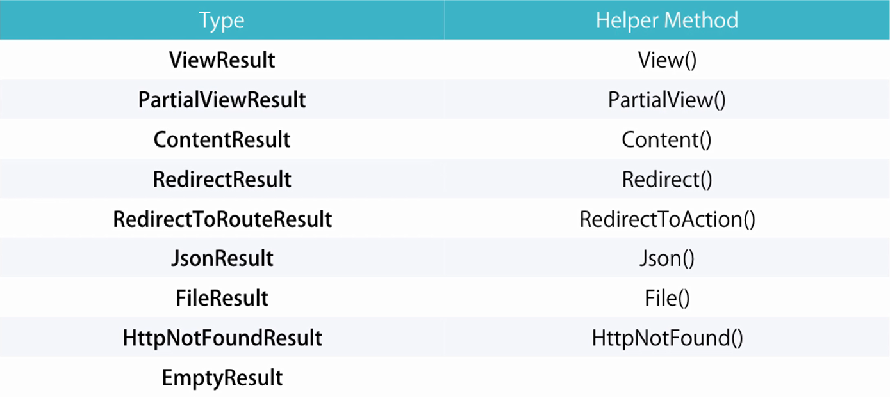

````csharp
public class MovieController : Controller
{
	// GET: Movies/Random
	public ActionResult Random()
	{
		var movie = new Movie() { Name = "Shrek!" };
		return View(movie);
		// return new EmptyResult();
	}
}
````

`ActionResult` is the base class for all types of results that can be returned from an Controller  
`EmptyResult` does not have an helper class



Redirects do not support POST Verb so data can only be sent in the URL

````csharp
public class MovieController : Controller
{
	// GET: Movies/Random
	public ActionResult Random()
	{
		var movie = new Movie() { Name = "Shrek!" };
		// Controller Name, Action Name
		return new RedirectToRouteResult("Index", "Home", new {
			name = "David", age = 1
		})
	}
}
````

### Action Arguments

If an Action Method takes an parameter then MVC framework looks for request data with the same parameter  
This parameter can be in the URL, Query String or Embedded in request from Form

To make parameter optional we should mark them as **Nullable**

````csharp
public ActionResult Index(int? pageIndex, string? sortBy)
{
	if (!pageIndex.HasValue)
		pageIndex = 1;

	if (string.IsNullOrWhiteSpace(sortBy))
		sortBy = "Name";

	return Content($"pageIndex={pageIndex}&sortBy={sortBy}");
}
````

### Attribute Routing

Attribute Routing allows us to specify an Custom Route for an Action  
[Routing Constrains With Attribute Routing in MVC 5.0](https://www.c-sharpcorner.com/UploadFile/ff2f08/routing-constrains-with-attribute-routing-in-mvc-5-0/)

````csharp
[HttpGet]
[Route("Movies/Released/{year}/{month:regex(\\d{2}):range(1, 12)}")]
public ActionResult ByReleaseDate(int year, int month)
{
	return Content($"{year}/{month}");
}
````
