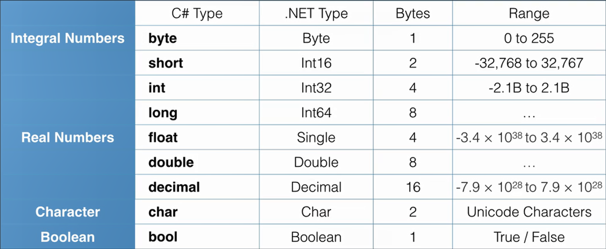

[Built-in types - C# reference | Microsoft Docs](https://docs.microsoft.com/en-us/dotnet/csharp/language-reference/builtin-types/built-in-types)

Constants must be initialized during declaration  
Variable names cannot start with a number  
Reserved keywords shouldn't be used as variables names. If they have to used it needs to be prefixed with the @ sign

Strings in C# are enclosed in double quotes ("...")  
Characters in C# are enclosed in single quotes ('...')

When we compile C# code each datatype is converted to its equivalent .NET datatype  
All datatypes in C# are derived or extended from the `System.Object`



 > [!note]
 > In C# the default real number datatype is "double" so float and decimal need to be declared explicitly
 > 
 > ````csharp
 > float num1 = 2.1f;
 > decimal num2 = 2.21m
 > ````

var datatype tells C# to automatically infer datatype  
It can only be used if the variable is initialized and declared on the same line

Declare variables in C# using the .NET equivalent types is also possible  
The type of an object can be checked by using the `FullName` property of the `GetType()` class

````csharp
string name1 = "Irene"; 
String name2 = "Wendy";
Console.WriteLine("{0}, {1}", name1, name2); 

int num1 = 12; 
Int32 num2 = 13;
Console.WriteLine("{0}, {1}", num1, num2);

Console.WriteLine(name1.GetType().FullName);
````