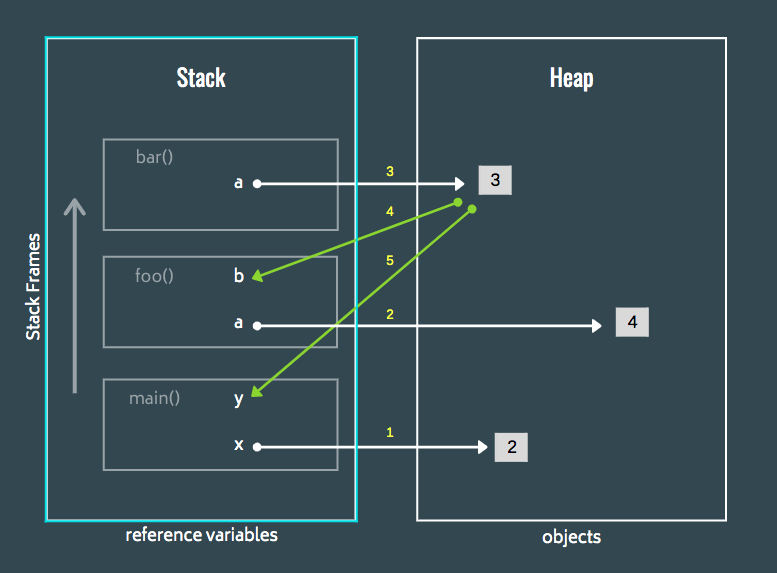

### Heap and Stack Memory

The Heap is used to hold the **actual** value of the reference type objects (The reference variable is stored in the stack)

 > [!important]
 > * Memory Heap is not the same as the Data Structure Heap
 > * Memory Heap is free space reserved for storing values that are required by the program

The Stack memory is used to hold the the value type objects

Each function in the program gets its own Stack Frame in the stack memory  
Each frame stores some metadata along with it which helps to identify the scope of the variables (Local and Global variables)  
Classes are created in the Heap memory and the methods of the class are created on the Stack memory from where they interact with the object in the Heap  
Stack Frame is removed from memory as soon as the function/ method is returned

---

### Reference Counting

Internally every object in Python holds three things : Its type, value and reference count  
The reference count is this table is incremented by 1 for each new reference of the object  
If the value of reference becomes zero the object is considered as a dead object and is removed by the garbage collector

---

### Garbage Collection

There are two main types of garbage collection:

* Reference Counting
* Tracing (Mask and Sweep)

Python uses reference counting for garbage collection along with generational garbage collection algorithm  
Weak Reference are not tracked by the garbage collector  
Reference counting garbage collection is not thread safe and cannot detect cyclic references hence generation algorithm is also required  
GIL exists in Python to prevent multiple threads from trying to change the reference count of objects at the same time

Java garbage collector is uses Mark and Sweep algorithm, where the objects that cannot be reached are marked as dead (reference count is 0) and are removed from memory when a certain threshold is reached

---

**<u>References</u>**:

* [Nina Zakharenko - Memory Management in Python - The Basics - PyCon 2016 - YouTube](https://www.youtube.com/watch?v=F6u5rhUQ6dU&list=PLmcVoUOMmT5AJKptc3qf8CJ0ZINWoRoFh)
* [Pablo Galindo Salgado - Time to take out the rubbish: garbage collector - PyCon 2019 - YouTube](https://www.youtube.com/watch?v=CLW5Lyc1FN8&list=PLmcVoUOMmT5AJKptc3qf8CJ0ZINWoRoFh)
