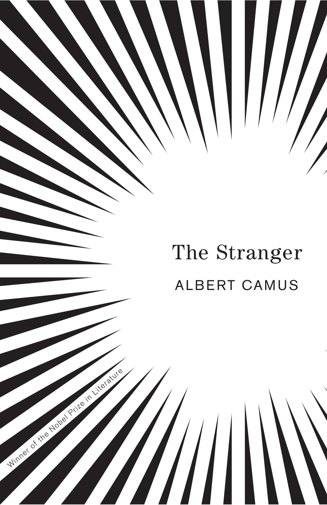
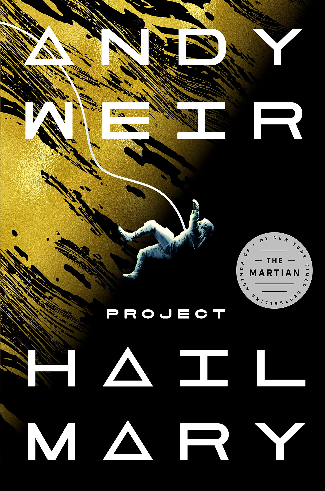

| No. |                                            Cover                                            |                 Name                 |              Author               |                      Genre                      |                                        Goodreads                                        |   Status   |
|:---:|:-------------------------------------------------------------------------------------------:|:------------------------------------:|:---------------------------------:|:-----------------------------------------------:|:---------------------------------------------------------------------------------------:|:----------:|
|     |                           |       They Do It With Mirrors        |          Agatha Christie          |        Fiction, Mystery, Crime, Triller         |        [Link](https://www.goodreads.com/book/show/68930.They_Do_It_With_Mirrors)        | #completed |
|     |                                     |          Kafka on the Shore          |         Hauruki Murakami          |        Fiction, Magical-Realism, Fantasy        |           [Link](https://www.goodreads.com/book/show/4929.Kafka_on_the_Shore)           | #completed |
|     |                           |       The Art of Invisibility        |           Kevin Mitnick           |             Non-Fiction, Technology             |      [Link](https://www.goodreads.com/book/show/30363785-the-art-of-invisibility)       | #completed |
|     |  | The Hitchhiker's Guide to the Galaxy |           Douglas Adams           |        Fiction, Humor, Fantasy, Classics        | [Link](https://www.goodreads.com/book/show/386162.The_Hitchhiker_s_Guide_to_the_Galaxy) | #completed |
|     |                                               |            The Alchemist             |           Paulo Coelho            |      Fiction, Fantasy, Adventure, Classics      |           [Link](https://www.goodreads.com/book/show/18144590-the-alchemist)            | #completed |
|     |                                 |         Crime and Punishment         |         Fyodor Dostoevsky         |     Fiction, Crime, Physiological, Classics     |          [Link](https://www.goodreads.com/book/show/7144.Crime_and_Punishment)          | #completed |
|     |                       |      And Then There Where None       |          Agatha Christie          |        Fiction, Mystery, Crime, Thriller        |       [Link](https://www.goodreads.com/book/show/16299.And_Then_There_Were_None)        | #completed |
|     |                                          |          The Da Vinci Code           |             Dan Brown             |           Fiction, Mystery, Thriller            |            [Link](https://www.goodreads.com/book/show/968.The_Da_Vinci_Code)            | #completed |
|     |                                       |          Angels and Demons           |             Dan Brown             |        Fiction, Mystery, Thriller, Crime        |              [Link](https://www.goodreads.com/book/show/960.Angels_Demons)              | #completed |
|     |                                           |           The Lost Symbol            |             Dan Brown             |        Fiction, Mystery, Thriller, Crime        |           [Link](https://www.goodreads.com/book/show/6411961-the-lost-symbol)           |  #completed   | 
|     |                                                                 |                 1984                 |           George Orwell           | Fiction, Politics, Fantasy, Dystopian, Classics |                [Link](https://www.goodreads.com/book/show/61439040-1984)                | #completed |
|     |                                                            |                Hamlet                |        William Shakespeare        |         Fiction, Drama, Play, Classics          |                 [Link](https://www.goodreads.com/book/show/1420.Hamlet)                 | #completed |
|     |                                                 |             The Stranger             |           Albert Camus            |        Fiction, Philosophical, Classics         |             [Link](https://www.goodreads.com/book/show/49552.The_Stranger)              | #completed |
|     |                                       |     The Divine Comedy (Inferno)      |          Dante Alighieri          |  Fiction, Poetry, Fantasy, Religion, Classics   |           [Link](https://www.goodreads.com/book/show/6656.The_Divine_Comedy)            | #completed |
|     |                                                 | [Why We Sleep](Why%20We%20Sleep.md)  |          Matthew Walker           |    Non-Fiction, Science, Health, Psychology     |            [Link](https://www.goodreads.com/book/show/34466963-why-we-sleep)            | #completed |
|     |                                                     |              Siddhartha              |           Herman Hesse            |        Fiction, Philosophical, Classics         |              [Link](https://www.goodreads.com/book/show/52036.Siddhartha)               | #completed |
|     |                                             |            Fahrenheit 451            |           Ray Bradbury            |      Fiction, Dystopian, Fantasy, Classics      |           [Link](https://www.goodreads.com/book/show/56302573-farenheit-451)            | #completed |
|     |                   |     The Murder of Roger Ackroyd      |          Agatha Christie          |        Fiction, Mystery, Crime, Thriller        |      [Link](https://www.goodreads.com/book/show/16328.The_Murder_of_Roger_Ackroyd)      | #completed |
|     |                                                         |               Zero Day               |          David Baldacci           |        Fiction, Triller, Mystery, Crime         |              [Link](https://www.goodreads.com/book/show/11007587-zero-day)              | #completed |
|     |                          |       Man's Search for Meaning       |         Viktor E. Frankl          |     Non-Fiction, History, Memoir, Biography     |        [Link](https://www.goodreads.com/book/show/4069.Man_s_Search_for_Meaning)        | #completed |
|     |                                                             |         [Ikigai](Ikigai.md)          | Francesc Miralles & Hector Garcia |   Non-Fiction, Self Help, Health, Psychology    |             [Link](https://www.goodreads.com/en/book/show/40534545-ikigai)              | #completed |
|     |                                       |          Project Hail Mary           |             Andy Weir             |        Fiction, Space, Fantasy, Triller         |         [Link](https://www.goodreads.com/book/show/54493401-project-hail-mary)          | #completed |
|     |                             |        The Kind Worth Killing        |           Peter Swanson           |        Fiction, Triller, Mystery, Crime         |       [Link](https://www.goodreads.com/book/show/21936809-the-kind-worth-killing)       |  #reading   |
|     |                                                   |             Dark Matter              |           Blake Crouch            |       Fiction, Mystery, Triller, Fantasy        |            [Link](https://www.goodreads.com/book/show/27833670-dark-matter)             |  #pending  |

[Read & Watch List](../Read%20&%20Watch%20List.md)