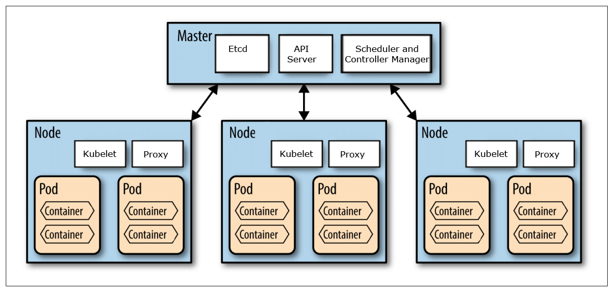

Three processes need to run on every worker node

* **Container Runtime** - Docker/ Containerd
* **Kubelet** - Receives instructions from Control Plane on what Pod to run. Responsible for starting Pods
* **Kube Proxy** - Forwards requests between the Nodes

Four processes need to run on every master node

* **API Server** - Used to communicate with the K8 cluster using a client (Provides Auth also)
* **Scheduler** - Decides where the containers are to be placed on the nodes (Kubelet starts the Pods)
* **Controller Manager** - Detects state changes on cluster and makes request to return cluster to consistent state
* **etcd** - Distributed key value store for storing cluster metadata (Cluster Brain). The status information of objects is also located here

The master node is also called **Control Plane**
