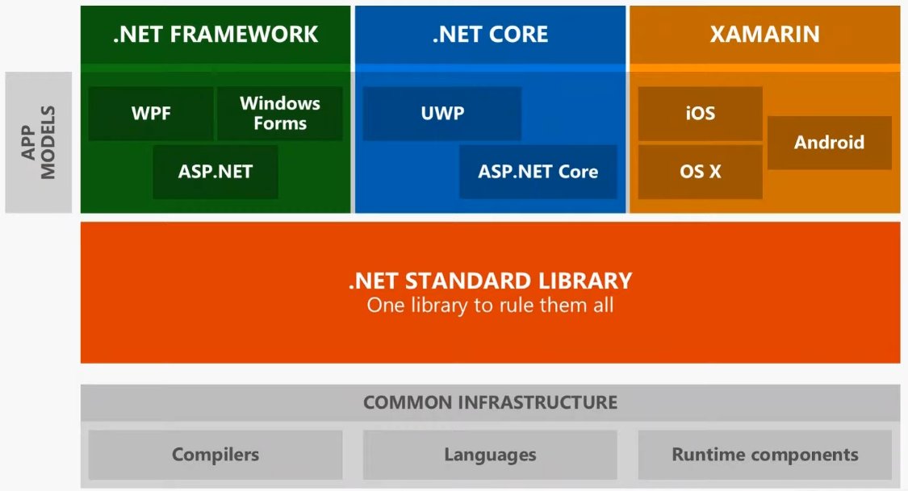

### .NET Framework

* Was released in the year 2002 and along allows to build Windows Applications
* It will not get new features but can still be used to build Windows only applications and App Modules that are only supported by .NET Framework (WPF, Windows Forms)
* The last version is 4.8

### .NET Core

* It is an reinterpretation of the .NET Framework with emphasis on cross platform compatibility
* The last version is 3.1

### .NET

* It is the continuation of the .NET Core project under a new name which will be followed from version 5 onward
* v4 was skipped as to not cause confusion with .NET Framework 4

### .NET Standard

* Set of common Base Class Libraries (BCL) which can be used across .NET implementations (.NET Framework, .NET Core, Xamarin, Mono) and supported OS
* It is an temporary solution that is used to bridge the gap between the various .NET implementations
* If our project is build on a newer Standard then we have access to a lot of new APIs but they will not run on very old versions of .NET
* .NET Standard will go away once .NET 6 is released as it is will merge all the BCLs implementation into a common BCLs that can be used across implementations
* The last version is 2.1

