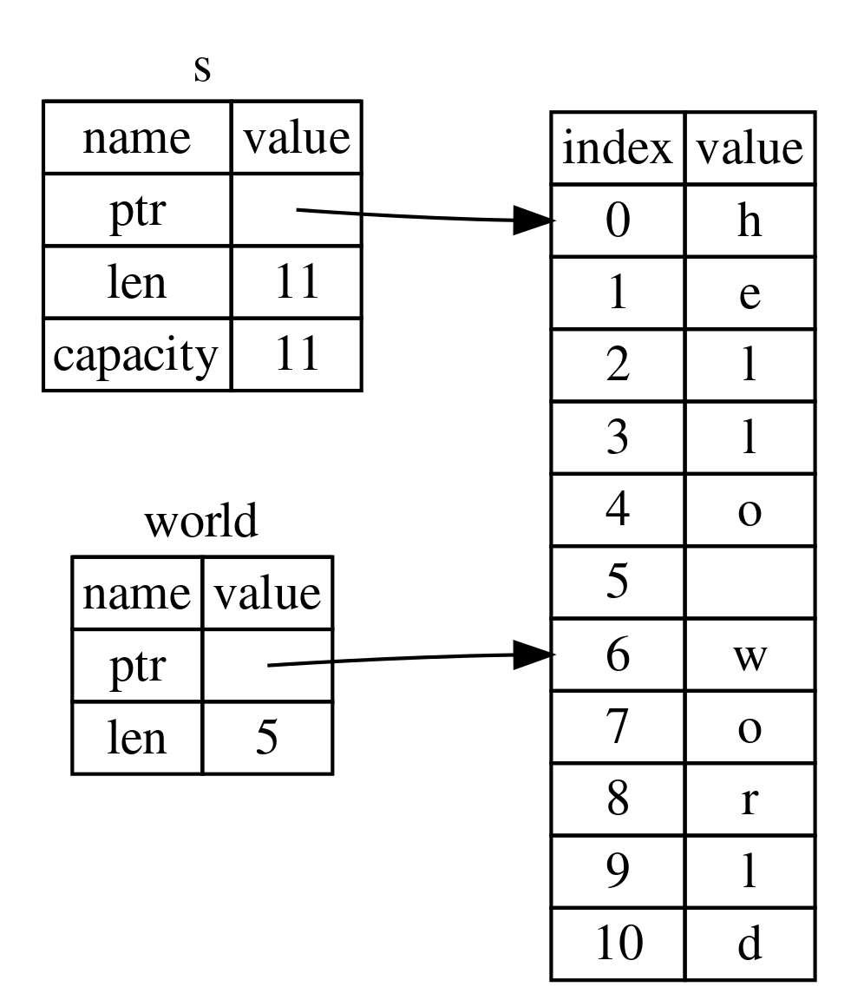

Allows to reference a contiguous sequence of elements in a collection without having to use the entire collection  
Similar to references slices do not take ownership of the underlying data  
String Literals are string slices (They slice to the location in the binary containing the string)

Slices work by storing a reference to the first element of the collection and a length  



String and String Literals are also both a type of String Slice

```rust
fn main() {
    let string1 = String::from("Hello World");
    
    let first_word = first_word(&string1);
    println!("First Word: {}", first_word);
}

fn first_word(string: &str) -> &str {
    let string_array = string.as_bytes();
    for (index, &char) in string_array.iter().enumerate() {
        if char == b' ' {
            return &string[..index];
        }
    }

    &string[..]
}
```

A similar syntax can be used to slice other compound objects also

```rust
let array = [10, 20, 30, 40, 50, 60];
let array_slice = &array[0..=2];
println!("{:?}", array_slice);
```