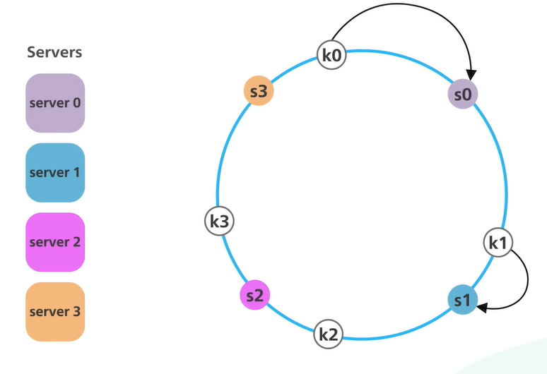
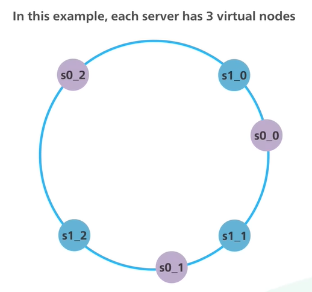

Large Scale System - Data cannot be stored on single server  
So Data needs to be **Distributed** across multiple nodes  
For predictable performance distributed data needs to be **evenly** on all servers

````js
serverIndex = Hash(Key) % N
N = No. of Servers
````

### Normal Hashing

The key of Object is hashed using hashing function which produces an numeric values which falls in a defined range (hash space). A good hash function evenly distribute the object keys across the hash space  
The modulo operation between this range and the no. of servers is performed to find the server on which the object will reside

### Drawback

This approach works well when the no. of clusters in the system is fixed  
When new servers are added into the cluster or a server in the cluster goes down there will be a storm of data redistribution and data misses  
Will the hash values does not need to be recomputed the no. of servers will be different and so is the mapping of the server to which the data belongs  
In systems where servers are continuously added and removed this type of design is untenable

---

### Consistent Hashing

Instead of just hashing the objects the server names are also hashed  
They are both hashed using the same hashing function and will map to the same hash space  
The start and end of the hash space is connected together to create a hash ring

The server names (IP Address) are hashed and added onto the ring  
Similarly the objects are hashed and added onto the ring (the modulo operation is not performed)



To find the node to which the data will belong we just need to look to the right (clockwise direction) and find the first node  
Because of this approach even when a new server is added into the system only a fraction of the keys need to be redistributed

### Drawbacks

When the distribution of the servers and objects are not even then a large amount of the data could belong to a single server  
This gets even worse when constantly servers are added and removed from the cluster

### Solution

Virtual nodes are used instead of physical nodes  
Virtual nodes can appear at different locations on the ring



With virtual nodes each server handles multiple segments on the ring  
In real world applications the no. of virtual nodes is much greater than three and this makes the distribution of data much more even  
Additional space is required to store metadata related to the virtual servers

[Consistent Hashing | Algorithms Every Developer Should Know For System Design - YouTube](https://www.youtube.com/watch?v=UF9Iqmg94tk)

---

[System Design](System%20Design.md)
