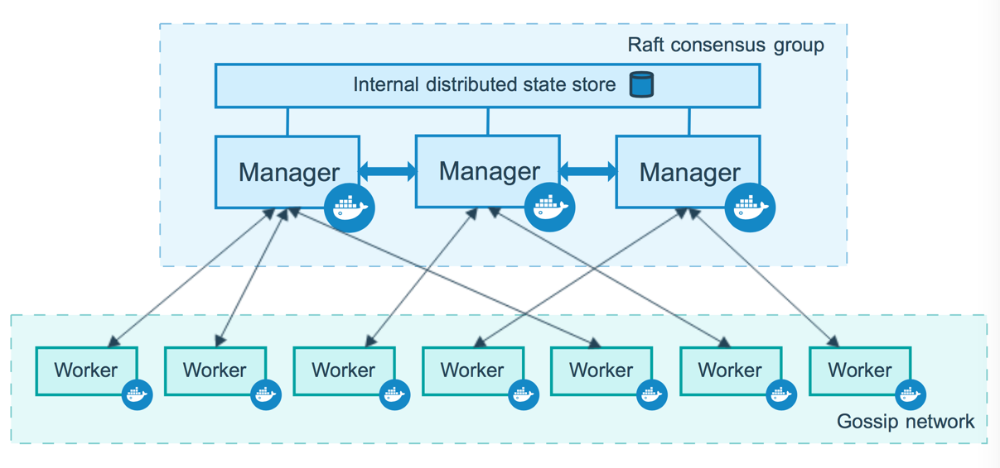
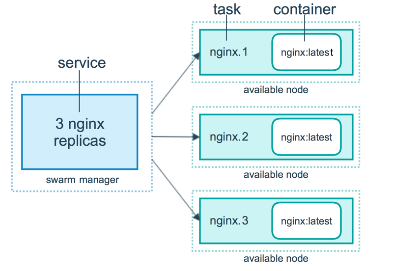

**<u>Manager Nodes</u>**  
An manager node is an node with permissions to control worker nodes  
Have an inbuild database called **Raft** its stores the information related to the cluster  
The Database is synchronized between all the manager nodes in the cluster  
The data shared among the nodes is protected using TLS  
An manager node can be an worker node as well

**<u>Worker Nodes</u>**  
Nodes where the docker images are actually executed

The `swarm service` command replaces the `docker run` command it allows us to specify replicas for each service will was not possible previously  
A single service can have multiple tasks and each task will be a container